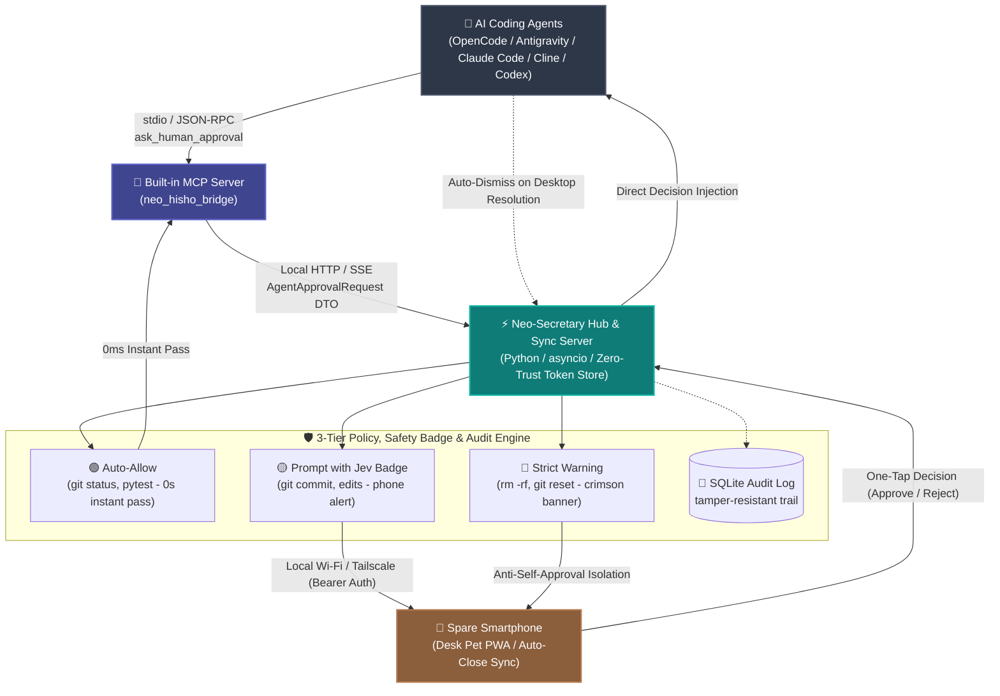

# Neo-Secretary (ネオ秘書くん) 🐾
### Remote Approval Companion & Pixel Desk Pet for Autonomous AI Coding Agents

[](https://github.com/Siitake-man/hisho-kun/actions/workflows/ci.yml)

[](https://www.python.org/)
[](https://github.com/Siitake-man/hisho-kun/releases/tag/v1.1.17)
[](tests/)
[](README_ja.md)

> 🇯🇵 **日本語のドキュメントはこちら！** ➔ [README_ja.md](README_ja.md) をご覧ください。  
> ☕ **"Approve your AI coding agent from your phone while taking a coffee break."**  
> Turn your spare smartphone into an adorable retro-style **Desk Pet** & zero-trust remote approval cockpit for **OpenCode, Antigravity, Claude Code, Cline, Cursor, and Codex**.

---

<p align="center">
  
</p>

<p align="center" style="margin: 24px 0;">
  <a href="https://siitake-man.github.io/hisho-kun/neo-secretary-showcase-en.html">
    
  </a>
  &nbsp;&nbsp;
  <a href="https://siitake-man.github.io/hisho-kun/guides/NEO_HISHO_CHEAT_SHEETS_en.html">
    
  </a>
  &nbsp;&nbsp;
  <a href="https://github.com/Siitake-man/hisho-kun/releases/tag/v1.1.17">
    
  </a>
</p>

<p align="center">
  
  &nbsp;&nbsp;&nbsp;&nbsp;&nbsp;&nbsp;&nbsp;&nbsp;
  
</p>

<p align="center"><sub>▲ Breathing pixel mascots live on your desktop and phone to support your autonomous development 👔🐚</sub></p>

<p align="center">
  
  &nbsp;&nbsp;
  
  &nbsp;&nbsp;
  
</p>

---

## ⚡ The Problem: AI Coding Stops When You Step Away

Autonomous coding agents (**OpenCode, Antigravity, Claude Code, Cline, Cursor, Codex**) are incredible, but they hit an inevitable bottleneck:  
**They constantly pause to ask for user permission before executing terminal commands or editing files.**

- You step away to brew coffee or take a walk ➔ **Agent halts at `git push`, `npm test`, or file writes.**
- You sit on the couch or leave your desk ➔ **Your autonomous development completely freezes.**

### 💡 The Solution: Neo-Secretary Remote Cockpit

1. **Zero-Config Mobile Pairing**: Scan a QR code from your spare smartphone (iOS/Android). No app store installation required — runs seamlessly as an offline-capable PWA.
2. **One-Tap Remote Approval & Direct Injection**: When an agent requests command approval, your phone vibrates and pulses an alert banner. Review the full command and tap **✅ Approve (Once)**, **✅ Always**, or **🛑 Reject**. The decision is injected directly into the agent runtime in real-time.
3. **PC & Mobile State Auto-Sync (`cancel_pending`)**: If you approve on your PC first, the mobile card dismisses automatically in sub-seconds. No lingering notification cards.
4. **Desk Pet & Retro Aesthetic**: A 16-bit pixel companion breathes and reacts on both screens, bringing warmth, nostalgia, and companionship to sterile terminal workflows.

---

## 🌟 What's New in v1.1.17 (Two-Way Bridge & Robustness)

- 🔄 **Bidirectional Approval Injection & PC Cancel Sync**: OpenCode (`hisho-approval-notify` v1.3.2) and Antigravity hooks now support two-way approval injection (`once`/`always`/`reject`). When an approval or question is resolved on PC, the mobile card is automatically dismissed via `POST /api/agent/cancel_pending`.
- 💬 **Interactive Question & Choice Forwarding**: Agent clarification modals (`ask_question`, `ask_input`) are delivered directly to your mobile Desk Pet sheet with interactive choice buttons.
- 🔀 **20-Second Auto-Rotating Suggestion Carousel**: Re-enabled smooth auto-rotation of pending tasks, calendar schedules, and AI news headlines on the mobile UI without freezing Canvas render loops.
- 🛡️ **Hardened Zero-Trust & Identity-Based Isolation**: Cryptographic 256-bit device token ledger, anti-self-approval domain boundary (PC loopback vs remote devices), and strict fail-closed LAN defense.
- 🧪 **964+ Automated Tests Passing**: Robust test suite spanning unit tests, integration tests, fuzzing, and regression tests ensuring zero-drift reliability.

---

## 🏛️ System Architecture & Data Flow



---

## 🚀 Quick Start

### Prerequisites
- **Windows PC** (Python 3.11+)
- **Smartphone** (iOS / Android with any modern browser)
- **Local Wi-Fi** (PC and phone on the same network, or Tailscale VPN)

### 1. Installation

```bash
git clone https://github.com/Siitake-man/hisho-kun.git
cd hisho-kun

# Setup virtual environment
python -m venv venv
venv\Scripts\activate

# Install dependencies
pip install -r requirements.txt
```

### 2. Configuration

```bash
copy .env.example .env
# Open .env and insert at least one LLM API key (OpenCode GO, Gemini, OpenAI, Claude, etc.)
```

### 3. Launch

```bash
venv\Scripts\python.exe main.py
```

A pixel companion will appear in the bottom-right corner of your desktop! 🎉

### 4. Connect Phone

1. Right-click the PC companion ➔ **📱 Smartphone Connection**
2. Scan the displayed QR code with your phone camera
3. Tap "Add to Home Screen" to install as a fullscreen PWA!

---

## 🤖 AI Agent MCP Setup (One-Liner)

Neo-Secretary includes a native **Model Context Protocol (MCP)** server (`neo_hisho_bridge`). You can register it to all your AI agent environments with a single command:

```bash
venv\Scripts\python.exe mcp_installer.py --all
```

- **Supported Clients**: OpenCode, Antigravity, Claude Code, Claude Desktop, Cursor, Cline, VS Code.

---

## 🎮 Interactive Web Blueprints & Cheat Sheets

Explore our live interactive architecture diagrams and cheat sheets:
- [🌟 Interactive System Blueprint (English)](https://siitake-man.github.io/hisho-kun/neo-secretary-showcase-en.html)
- [📘 Official Infographic Guide & Cheat Sheets (English)](https://siitake-man.github.io/hisho-kun/guides/NEO_HISHO_CHEAT_SHEETS_en.html)

---

## 📄 License

Distributed under the MIT License. See [LICENSE](LICENSE) for more information.

---

*Neo-Secretary — Your Desktop & Mobile Autonomous AI Companion 🤖✨*