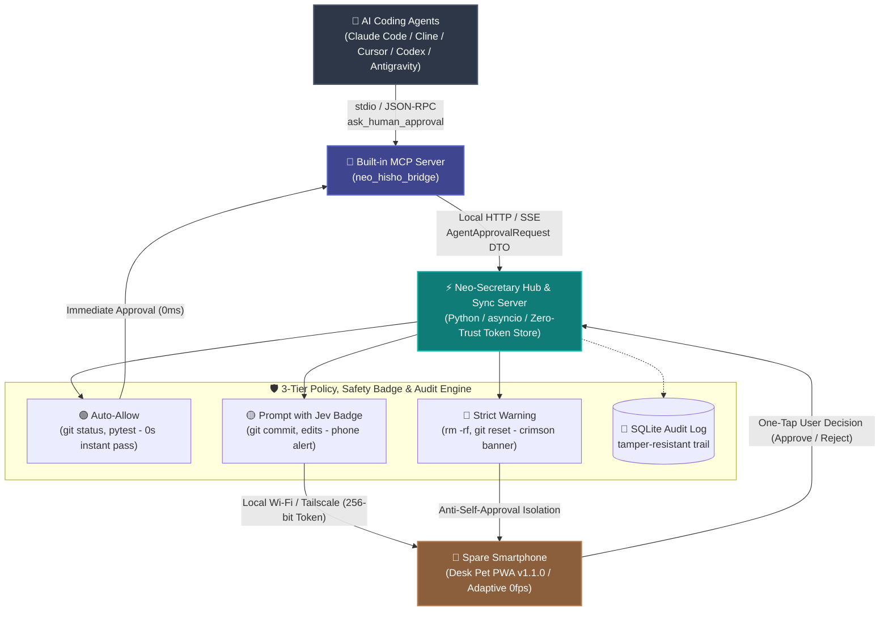

# Neo-Secretary (ネオ秘書くん) 🐾
### Remote Approval Companion & Desktop Pet for AI Coding Agents

[](https://github.com/Siitake-man/hisho-kun/actions/workflows/ci.yml)

[](https://www.python.org/)
[](https://github.com/Siitake-man/hisho-kun/releases/tag/v1.1.0)
[](README.md)

> ☕ **"Approve your AI coding agent from your phone while taking a coffee break."**  
> Turn your spare smartphone into an adorable retro-style **Desk Pet** & remote approval cockpit for **Claude Code, Cline, Cursor, Codex, and Antigravity**.

---

<p align="center">
  
</p>

<p align="center" style="margin: 24px 0;">
  <a href="https://siitake-man.github.io/hisho-kun/neo-secretary-showcase-en.html">
    
  </a>
  &nbsp;&nbsp;
  <a href="https://siitake-man.github.io/hisho-kun/guides/NEO_HISHO_CHEAT_SHEETS_en.html">
    
  </a>
  &nbsp;&nbsp;
  <a href="https://github.com/Siitake-man/hisho-kun/releases/tag/v1.1.0">
    
  </a>
</p>

<p align="center">
  
  &nbsp;&nbsp;&nbsp;&nbsp;&nbsp;&nbsp;&nbsp;&nbsp;
  
</p>

<p align="center"><sub>▲ Breathing pixel mascots live on your desktop and phone to support your autonomous development 👔🐚</sub></p>

<p align="center">
  
  &nbsp;&nbsp;
  
  &nbsp;&nbsp;
  
</p>

---

## ⚡ The Problem: AI Coding Stops When You Step Away

Autonomous coding agents (**Claude Code, Cline, Cursor, Codex, Antigravity**) are incredible, but they hit an inevitable bottleneck:  
**They constantly pause to ask for user permission before executing terminal commands or editing files.**

- You step away to brew coffee or take a walk ➔ **Agent halts at `git push`, `npm test`, or file writes.**
- You sit on the couch or leave your desk ➔ **Your autonomous development completely freezes.**

### 💡 The Solution: Neo-Secretary Remote Cockpit

1. **Zero-Config Mobile Pairing**: Scan a QR code from your spare smartphone (iOS/Android). No app store installation required — runs seamlessly as an offline-capable PWA.
2. **One-Tap Remote Approval**: When an agent requests command approval, your phone vibrates and pulses an alert banner. Review the full command and tap **✅ Approve** or **🛑 Reject** with one hand (or via earphone controls).
3. **Desk Pet & Retro Aesthetic**: A 16-bit pixel companion breathes and reacts on both screens, bringing warmth, nostalgia, and companionship to sterile terminal workflows.

---

## 🌟 What's New in v1.1.0 (Zero-Trust & Agent Bridge)

- 🛡️ **Zero-Trust Device-Individual Authentication**: Each paired phone receives a cryptographically secure 256-bit token. When an unrecognized phone attempts connection, a 10-second countdown Human-in-the-Loop dialog appears on host PC, enforcing fail-closed isolation against unauthorized LAN requests.
- 🟢 **Intelligent Approval Cards & AI Safety Badge**: When coding agents conduct automated security audits (such as TypeSafe Jev Tool Guard), Neo-Secretary parses the audit score and renders an emerald-green neon badge (`🟢 Jev Safety: ALLOW`) directly on your mobile screen.
- 🔋 **Adaptive Canvas 0fps Battery Optimization**: Prevents heat and battery drain by automatically sleeping the Canvas render loop to 0fps when the pet is idle, waking instantly upon alerts or touch (Wake-on-Demand).
- 🚀 **Full Headless Cross-Platform CI/CD**: Verified with GitHub Actions running 660+ tests across Ubuntu (with headless Xvfb) and Windows 64-bit on Python 3.11, 3.12, and 3.13.

---

## 🏛️ System Architecture & Data Flow



### 📡 ASCII Data Flow Blueprint

```text
[ AI Coding Agents ] (Claude Code / Cline / Cursor / Codex / Antigravity)
       │
       ▼ (stdio / JSON-RPC: Model Context Protocol)
[ Built-in MCP Server ] (neo_hisho_bridge)
       │
       ▼ (Local HTTP / Normalized AgentApprovalRequest DTO)
[ Neo-Secretary Hub Server ] (Python / asyncio)
       │ ├─ 🟢 Auto-Allow   : Zero-delay auto-resolution for safe reads/tests
       │ ├─ 🟡 Prompt       : Push alert to phone with AI Safety Badge
       │ ├─ 🔴 Strict       : Crimson pulsing banner for destructive commands
       │ └─ 📝 Audit Log    : SQLite persistent tamper-resistant audit trail
       ▼ (Local Wi-Fi / Tailscale: 256-bit Cryptographic Token & Device Registry)
[ Spare Smartphone ] 📱 "🟢 Jev Safety: ALLOW (0.99) - One-tap approval from couch!"
```

---

## 🚀 3-Step Setup for Your Agents

Neo-Secretary provides a high-performance **MCP (Model Context Protocol)** server with zero setup.

### Option A: Antigravity / Claude Code
Click **"Auto-Register to Antigravity / Agents"** inside Neo-Secretary's settings tab, or run:
```bash
claude mcp add hisho-bridge -- python "C:/path/to/hisho-kun/hisho_mcp_server.py"
```

### Option B: Cline / Cursor / Codex (VS Code)
Add this to your `cline_mcp_settings.json` or MCP config:
```json
{
  "mcpServers": {
    "neo-hisho": {
      "command": "python",
      "args": ["C:/path/to/hisho-kun/hisho_mcp_server.py"],
      "disabled": false,
      "autoApprove": []
    }
  }
}
```

---

## 🛡️ Security: Local-Only 3-Layer Zero-Trust Defense

Neo-Secretary does **not** route your commands or data through any external cloud.

1. **Cryptographic Device Tokens**:
   - Each pairing generates a unique 256-bit token stored as salted hashes. Unrecognized LAN devices receive immediate `403 Forbidden` isolation.
2. **Fail-Closed Human Approval**:
   - When a new phone connects, a 10-second modal dialog pops up on the host PC. No token is ever issued without explicit host approval.
3. **Requester-Approver Separation & Anti-RCE**:
   - Commands can only originate from `127.0.0.1` (localhost). Requester IP and Approver IP matching is forbidden, structurally preventing malicious LAN attackers from self-approving remote code execution.

---

## 📦 Quick Start

### Option 1: Standalone Windows App (Easiest)
1. Download **`NeoHisho_v1.1.0_win64.zip`** from [Latest Releases](https://github.com/Siitake-man/hisho-kun/releases/tag/v1.1.0).
2. Extract the archive and launch **`NeoHisho.exe`**.
3. Scan the QR code with your spare smartphone to start!

### Option 2: Running from Source
```bash
# Clone the repository
git clone https://github.com/Siitake-man/hisho-kun.git
cd hisho-kun

# Create and activate virtual environment
python -m venv venv
.\venv\Scripts\activate

# Install dependencies
pip install -r requirements.txt

# Start Neo-Secretary
python main.py
```

---

## 🗺️ Product Roadmap

- **Layer 1 [Core]**: AI Agent Remote Approval Platform (Claude Code, Cline, Cursor, Antigravity).
  - *Shipped in v1.1.0 ✅*: `Agent Adapter`, `Approval Policy` (3-tier engine), `Zero-Trust Token Manager`, `Jev Safety Badge`.
  - *Upcoming v1.2.0*: Full Internationalization (i18n - English/Japanese toggle for all desktop & mobile UI).
- **Layer 2 [Soul]**: Pixel Pet & Desk Mascot.
  - *Shipped in v1.1.0 ✅*: Adaptive Canvas 0fps power-saving mode, custom particle effects.
  - *Upcoming v1.2.0*: Custom Pet Modding framework (`assets/custom_pets/<chara_id>/`).
- **Layer 3 [Base]**: Personal Dashboard (TODO, Habit Tracker, Google Calendar iCal read-only sync, Pomodoro).
- **Desktop Modernization**: Migration path from Tkinter to **Tauri (Rust + Web)** for cross-platform Mac/Linux support.

---

## 📄 License

Distributed under the **MIT License**. See [`LICENSE`](LICENSE) for details.  
Created with passion by [Siitake-man](https://github.com/Siitake-man).
