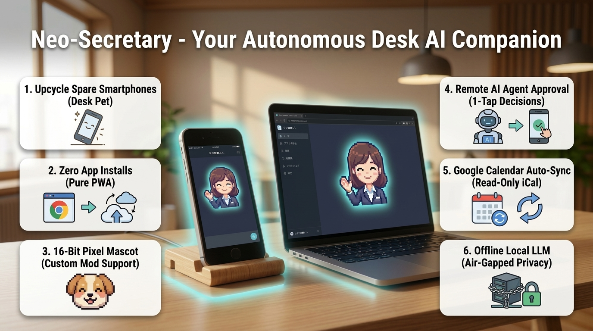
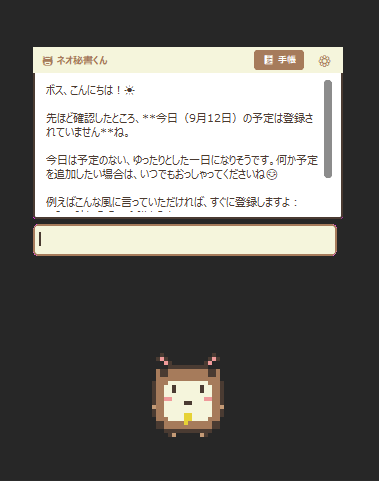
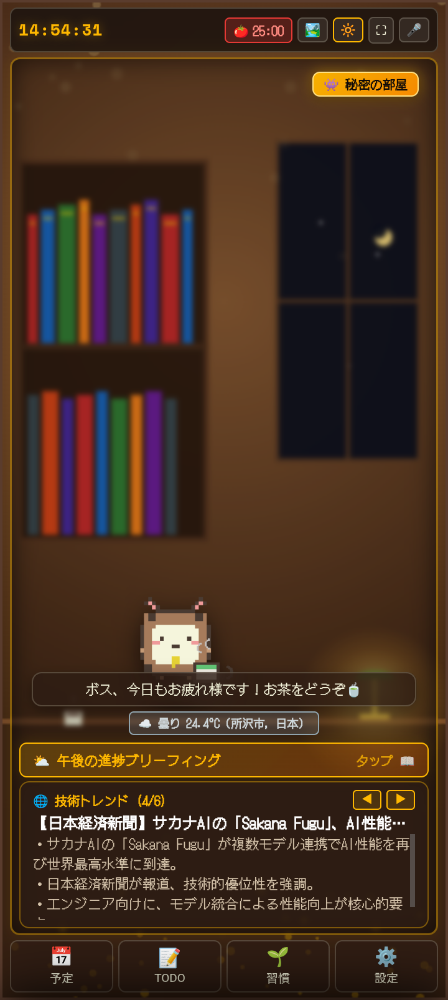
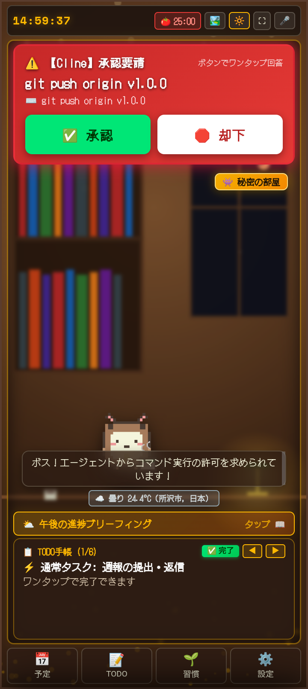
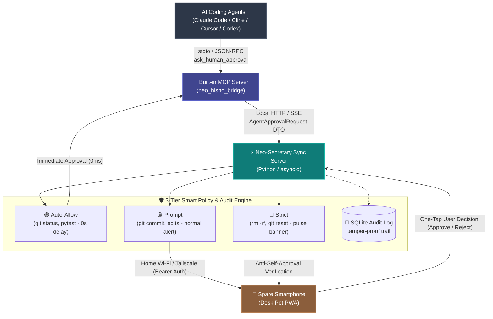

# Neo-Secretary (ネオ秘書くん) 🐾
### Remote Approval Companion & Desktop Pet for AI Coding Agents

[](https://github.com/Siitake-man/hisho-kun/actions/workflows/ci.yml)
[](LICENSE)
[](https://www.python.org/)
[-informational.svg)](https://github.com/Siitake-man/hisho-kun)

> ☕ **"Approve your AI coding agent from your phone while taking a coffee break."**  
> Turn your spare smartphone into an adorable retro-style **Desk Pet** & remote approval cockpit for **Claude Code, Cline, Cursor, and Codex**.

---

<p align="center">
  
</p>

<p align="center" style="margin: 24px 0;">
  <a href="https://siitake-man.github.io/hisho-kun/neo-secretary-showcase-en.html">
    
  </a>
  &nbsp;&nbsp;
  <a href="https://siitake-man.github.io/hisho-kun/guides/NEO_HISHO_CHEAT_SHEETS_en.html">
    
  </a>
  &nbsp;&nbsp;
  <a href="https://github.com/Siitake-man/hisho-kun/releases/tag/v1.0.0">
    
  </a>
</p>

<p align="center">
  
  &nbsp;&nbsp;&nbsp;&nbsp;&nbsp;&nbsp;&nbsp;&nbsp;
  
</p>

<p align="center"><sub>▲ Breathing pixel mascots live on your desktop and phone to support your autonomous development 👔🐚</sub></p>

<p align="center">
  
  &nbsp;&nbsp;
  
  &nbsp;&nbsp;
  
</p>

---

## ⚡ The Problem: AI Coding Stops When You Step Away

Autonomous coding agents (**Claude Code, Cline, Cursor, Codex**) are incredible, but they hit a wall:  
**They constantly pause to ask for user permission before executing terminal commands or editing files.**

- You step away to make a cup of coffee ➔ **Agent halts at `git push` or `npm install`.**
- You sit on the couch or leave your desk ➔ **Development completely stops.**

### 💡 The Solution: Neo-Secretary Remote Cockpit

1. **Zero-Config Pairing**: Scan a QR code from your spare smartphone (iOS/Android). No app store downloads, runs as a battery-friendly PWA.
2. **One-Tap Remote Approval**: When your agent requests approval, your phone vibrates and flashes an alert banner. Review the full command and tap **✅ Approve** or **🛑 Reject** with one hand.
3. **Desk Pet & Retro Aesthetic**: A 16-bit pixel companion breathes and reacts on both screens, bringing warmth and fun to sterile terminal workflows.

---

## 🏛️ System Architecture & Data Flow



### 📡 ASCII Data Flow Blueprint

```text
[ AI Coding Agents ] (Claude Code / Cline / Cursor / Codex)
       │
       ▼ (stdio / JSON-RPC: Model Context Protocol)
[ Built-in MCP Server ] (neo_hisho_bridge)
       │
       ▼ (Local HTTP / Normalized AgentApprovalRequest DTO)
[ Neo-Secretary Sync Server ] (Python / asyncio)
       │ ├─ 🟢 Auto-Allow : Zero-delay auto-resolution for safe reads/tests
       │ ├─ 🟡 Prompt     : Push alert to phone for standard edits/commits
       │ ├─ 🔴 Strict     : Crimson pulsing banner for destructive commands
       │ └─ 📝 Audit Log  : SQLite tamper-proof audit trail with timestamps
       ▼ (Home Wi-Fi / Tailscale: Bearer Auth & Anti-Self-Approval)
[ Spare Smartphone ] 📱 "One-tap approval from bed or kitchen!"
```

<p align="center" style="margin: 24px 0;">
  <a href="https://siitake-man.github.io/hisho-kun/neo-secretary-showcase-en.html">
    
  </a>
  &nbsp;&nbsp;
  <a href="https://siitake-man.github.io/hisho-kun/guides/NEO_HISHO_CHEAT_SHEETS_en.html">
    
  </a>
  &nbsp;&nbsp;
  <a href="https://github.com/Siitake-man/hisho-kun/releases/tag/v1.0.0">
    
  </a>
</p>

---

## 🚀 3-Step Setup for Your Agents

Neo-Secretary provides a high-performance **MCP (Model Context Protocol)** server with zero setup.

### Option A: Claude Code
Run Claude Code with the Neo-Secretary MCP server:
```bash
claude mcp add hisho-bridge -- python "C:/path/to/hisho-kun/hisho_mcp_server.py"
```

### Option B: Cline / Cursor / Codex (VS Code)
Add this to your `cline_mcp_settings.json` or MCP config:
```json
{
  "mcpServers": {
    "neo-hisho": {
      "command": "python",
      "args": ["C:/path/to/hisho-kun/hisho_mcp_server.py"],
      "disabled": false,
      "autoApprove": []
    }
  }
}
```
*(Or simply click **"Auto-Register to Antigravity / Agents"** inside Neo-Secretary's settings tab!)*

---

## 🛡️ Security: Local-Only 3-Layer Defense

Neo-Secretary does **not** route your commands through any external third-party cloud.

1. **Bearer Authentication & Device Registry**:
   - Each pairing generates a cryptographic 256-bit token verified with constant-time SHA-256 comparison. Unauthorized LAN devices receive an immediate `401 Unauthorized`.
2. **Fail-Closed Pairing Window**:
   - Token exchange is restricted strictly to the 10-minute pairing window while the QR dialog is actively open on the host.
3. **Requester-Approver Separation & Anti-RCE**:
   - Commands can only be initiated from `127.0.0.1` (localhost). Requester IP and Approver IP matching is forbidden, structurally preventing malicious LAN attacks from self-approving remote code execution.

---

## 📦 Quick Start

### Prerequisites
- Windows 10 / 11 (Mac & Linux support coming in v2.0 via Tauri)
- Python 3.11+ (or download the pre-compiled `NeoHisho.zip` standalone executable from [Releases](https://github.com/Siitake-man/hisho-kun/releases))
- Smartphone on the same local Wi-Fi or connected via [Tailscale](https://tailscale.com/)

### Running from Source
```bash
# Clone the repository
git clone https://github.com/Siitake-man/hisho-kun.git
cd hisho-kun

# Create and activate virtual environment
python -m venv venv
.\venv\Scripts\activate

# Install dependencies
pip install -r requirements.txt

# Configure your environment
copy .env.example .env

# Start Neo-Secretary
python main.py
```

---

## 🗺️ Product Roadmap

- **Layer 1 [Core]**: AI Agent Remote Approval Platform (Claude Code, Cline, Cursor).
  - *Upcoming v1.1.0*: `Agent Adapter` (common approval DTO), `Approval Policy` (Auto-Allow / Prompt / Strict 3-tier engine), `Audit Log`.
- **Layer 2 [Soul]**: Pixel Pet & Desk Mascot.
  - *Upcoming v1.1.0*: Custom Pet Modding framework (`assets/custom_pets/<chara_id>/`).
- **Layer 3 [Base]**: Personal Dashboard (TODO, Habit Tracker, Google Calendar iCal read-only sync, Pomodoro).
- **Desktop Modernization**: Migration path from Tkinter to **Tauri (Rust + Web)** for cross-platform Mac/Linux support.

---

## 📄 License

Distributed under the **MIT License**. See [`LICENSE`](LICENSE) for details.  
Created with passion by [Siitake-man](https://github.com/Siitake-man).
