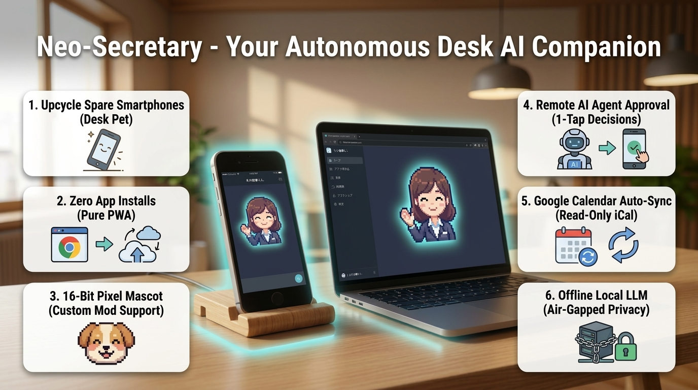
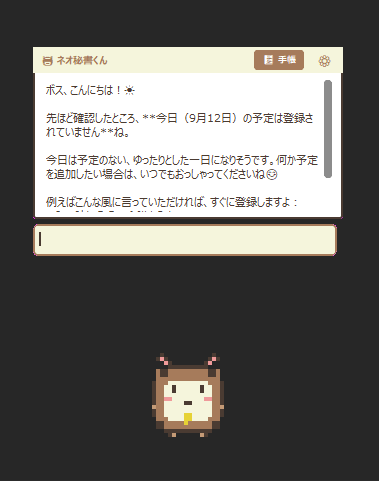
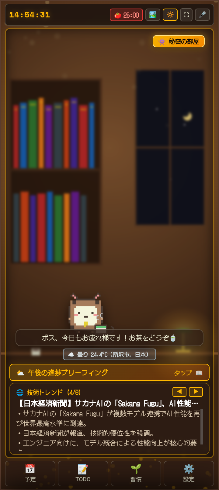
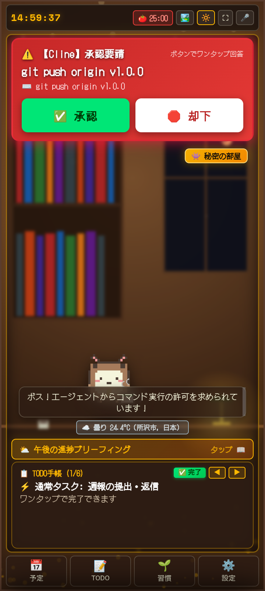
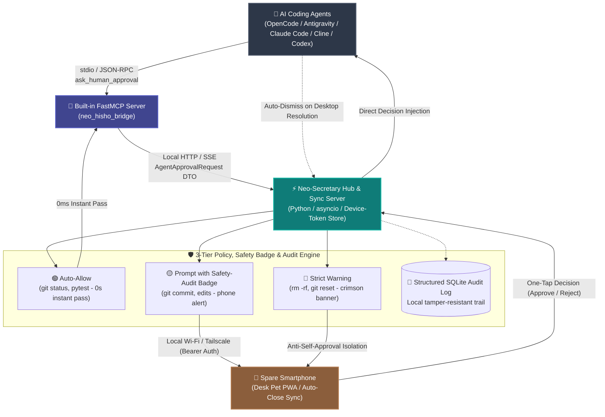

# Neo-Secretary (ネオ秘書くん) 🐾
### Remote Approval Companion & Pixel Desk Pet for Autonomous AI Coding Agents

> 📌 **Notice**: This document is an alias mirror of the primary English document. Please refer to [README.md](README.md) for the authoritative source.

[](https://github.com/Siitake-man/hisho-kun/actions/workflows/ci.yml)

[](https://www.python.org/)
[](https://github.com/Siitake-man/hisho-kun/releases/tag/v1.1.18)
[](tests/)
[](README_ja.md)

> 🇯🇵 **日本語のドキュメントはこちら！** ➔ [README_ja.md](README_ja.md) をご覧ください。  
> ☕ **"Not a mobile IDE for coding on the subway. An ambient awareness companion designed for your living space."**  
> Turn your spare smartphone into an adorable retro-style **Desk Pet** & local-first remote approval companion for **OpenCode, Antigravity, Claude Code, Cline, Cursor, and Codex**.

---

<p align="center">
  
</p>

<p align="center" style="margin: 24px 0;">
  <a href="https://siitake-man.github.io/hisho-kun/neo-secretary-showcase-en.html">
    
  </a>
  &nbsp;&nbsp;
  <a href="https://siitake-man.github.io/hisho-kun/guides/NEO_HISHO_CHEAT_SHEETS_en.html">
    
  </a>
  &nbsp;&nbsp;
  <a href="https://github.com/Siitake-man/hisho-kun/releases/tag/v1.1.18">
    
  </a>
</p>

<p align="center">
  
  &nbsp;&nbsp;&nbsp;&nbsp;&nbsp;&nbsp;&nbsp;&nbsp;
  
</p>

<p align="center"><sub>▲ Breathing pixel mascots live on your desktop and phone to support your autonomous development 👔🐚</sub></p>

<p align="center">
  
  &nbsp;&nbsp;
  
  &nbsp;&nbsp;
  
</p>

---

## ⚡ The Philosophy: Ambient Awareness vs. Mobile Coding Exhaustion

When developers attempt to supervise autonomous coding agents outside their desk, existing solutions often try to turn the phone into a pocket IDE (e.g. Paseo, SSH terminal mirrors, full web IDEs).  
However, **trying to read multi-file diffs and type complex terminal commands on a 6-inch phone while spending time with family or taking a break is exhausting.**

Neo-Secretary takes the exact opposite approach: **Minimum Cognitive Load.**

| Dimension | Mobile Web IDE / Full Terminal | 🐾 Neo-Secretary (Ambient Companion) |
|---|---|---|
| **Primary Arena** | Subway commute / Heavy mobile coding | **Living space / Coffee break / Desk side** |
| **Cognitive Load** | High (Read full diffs, pinch-to-zoom, virtual keyboard) | **Minimal (1-second glance, single tap decision)** |
| **Primary Interaction** | Command typing & code editing on mobile | **Approve / Reject / Clarification choices injection** |
| **Visual Presence** | Sterile, cold developer console | **Warm, breathing 16-bit pixel companion (Desk Pet)** |
| **Network & Privacy** | Cloud relay or external port forwarding | **Local-First LAN / Tailscale, Zero External Telemetry** |
| **Hardware Use** | Phone battery drain running heavy web app | **Upcycles idle spare phone into an ambient appliance** |

### 💡 The Core Workflow

1. **Zero-Install Mobile Pairing**: Scan a QR code from your spare smartphone (iOS/Android). No app store installation required — runs seamlessly as an offline-capable PWA.
2. **Two-Tier Integration Layer**:
   - **Direct Native Hook Injection (OpenCode / Antigravity)**: Intercepts terminal tool execution before run time, halting execution until remote approval.
   - **FastMCP Protocol Bridge (Claude Code / Cline / Cursor / Codex)**: Built-in `neo_hisho_bridge` MCP server provides `ask_human_approval`, `notify_task_completed`, and `remember_boss_insight`.
3. **One-Tap Remote Approval & Direct Injection**: When an agent requests command approval, your phone vibrates and pulses an alert banner. Review the command and tap **✅ Approve (Once)**, **✅ Always**, or **🛑 Reject**.
4. **PC & Mobile State Auto-Sync (`cancel_pending`)**: If you approve on your PC first, the mobile card dismisses automatically in sub-seconds. No lingering ghost notifications.
5. **Desk Pet & Retro Aesthetic**: A 16-bit pixel companion breathes and reacts on both screens, bringing warmth and emotional rhythm to autonomous workflows.

---

## 🌟 What's New in v1.1.18 (Two-Way Bridge & Robustness)

- 🔄 **Bidirectional Approval Injection & PC Cancel Sync**: OpenCode (`hisho-approval-notify` v1.3.2) and Antigravity hooks support two-way approval injection (`once`/`always`/`reject`). When resolved on PC, the mobile card is automatically dismissed via `POST /api/agent/cancel_pending`.
- 💬 **Interactive Question & Choice Forwarding**: Agent clarification modals (`ask_question`, `ask_input`) are delivered directly to your mobile Desk Pet sheet with interactive choice buttons.
- 🔀 **20-Second Auto-Rotating Suggestion Carousel**: Re-enabled smooth auto-rotation of pending tasks, calendar schedules, and AI news headlines on the mobile UI without freezing Canvas render loops.
- 🛡️ **Local-First Boundary Defense & Device-Token Ledger**: Cryptographic 256-bit device token ledger, anti-self-approval domain boundary (PC loopback vs remote devices), and structured SQLite audit ledger.
- 🧪 **980+ Automated Tests Passing**: Robust test suite spanning unit tests, integration tests, fuzzing, and regression tests ensuring zero-drift reliability.

---

## 🏛️ System Architecture & Data Flow


```mermaid
graph TD
    classDef agent fill:#2d3748,stroke:#4a5568,stroke-width:2px,color:#fff;
    classDef bridge fill:#40458f,stroke:#5a61c7,stroke-width:2px,color:#fff;
    classDef server fill:#0f7c78,stroke:#14b8a6,stroke-width:2px,color:#fff;
    classDef phone fill:#8b5e3c,stroke:#b47c50,stroke-width:2px,color:#fff;

    Agents["🤖 AI Coding Agents<br/>(OpenCode / Antigravity / Claude Code / Cline / Codex)"]:::agent
    MCP["🔌 Built-in FastMCP Server<br/>(neo_hisho_bridge)"]:::bridge
    Server["⚡ Neo-Secretary Hub & Sync Server<br/>(Python / asyncio / Device-Token Store)"]:::server
    PWA["📱 Spare Smartphone<br/>(Desk Pet PWA / Auto-Close Sync)"]:::phone

    Agents -->|"stdio / JSON-RPC<br/>ask_human_approval"| MCP
    MCP -->|"Local HTTP / SSE<br/>AgentApprovalRequest DTO"| Server

    subgraph DefenseEngine ["🛡️ 3-Tier Policy, Safety Badge & Audit Engine"]
        Auto["🟢 Auto-Allow<br/>(git status, pytest - 0s instant pass)"]
        Prompt["🟡 Prompt with Safety-Audit Badge<br/>(git commit, edits - phone alert)"]
        Strict["🔴 Strict Warning<br/>(rm -rf, git reset - crimson banner)"]
        Audit[("📝 Structured SQLite Audit Log<br/>Local tamper-resistant trail")]
    end

    Server --> Auto
    Server --> Prompt
    Server --> Strict
    Server -.-> Audit

    Auto -->|"0ms Instant Pass"| MCP
    Prompt -->|"Local Wi-Fi / Tailscale (Bearer Auth)"| PWA
    Strict -->|"Anti-Self-Approval Isolation"| PWA

    PWA -->|"One-Tap Decision (Approve / Reject)"| Server
    Server -->|"Direct Decision Injection"| Agents
    Agents -.->|"Auto-Dismiss on Desktop Resolution"| Server
```

---

## 🚀 Quick Start

### Prerequisites
- **Windows PC** (Python 3.11+)
- **Smartphone** (iOS / Android with any modern browser)
- **Local Wi-Fi** (PC and phone on the same network, or Tailscale VPN)

### 1. Installation

```bash
git clone https://github.com/Siitake-man/hisho-kun.git
cd hisho-kun

# Setup virtual environment
python -m venv venv
venv\Scripts\activate

# Install dependencies
pip install -r requirements.txt
```

### 2. Configuration

```bash
copy .env.example .env
# Open .env and insert at least one LLM API key (OpenCode GO, Gemini, OpenAI, Claude, etc.)
```

### 3. Launch

```bash
venv\Scripts\python.exe main.py
```

A pixel companion will appear in the bottom-right corner of your desktop! 🎉

### 4. Connect Phone

1. Right-click the PC companion ➔ **📱 Smartphone Connection**
2. Scan the displayed QR code with your phone camera
3. Tap "Add to Home Screen" to install as a fullscreen PWA!

---

## 📴 Bundled Offline Local AI (LFM2.5)

You can chat and interact with a local AI companion entirely on your device with **zero API keys and zero cost**.
If no model is downloaded upon first launch, Neo-Secretary will automatically guide you through setup.

| Preset | Download Size | Recommended Environment |
|---|---|---|
| ⭐ **Ultra-Lightweight** (LFM2.5-350M QAD-Q4_0) | ~230 MB | Fast and responsive on virtually any PC |
| **High-Quality** (LFM2.5-1.2B-Instruct QAD-Q4_0) | ~770 MB | 4GB+ RAM. Smarter contextual responses |

To setup manually:
```bash
python tools/setup_local_model.py              # Interactive selection
python tools/setup_local_model.py --model 1.2b # Directly install high-quality model
```

> 📄 **Model Credit**: This software uses **LFM2.5** by [Liquid AI](https://liquid.ai).  
> The model is provided under the **LFM Open License v1.0** ([Full License](https://huggingface.co/LiquidAI/LFM2.5-350M-GGUF/blob/main/LICENSE)). You can seamlessly switch between offline and cloud LLMs anytime via the settings UI or `.env`.

---

## 🤖 AI Agent Integration: 30-Second Wiring Guide

To bridge your AI coding agents with Neo-Secretary, choose either the **Automated One-Liner** or **Direct Config Snippets**.

### Method 1: Automated One-Liner (Recommended)

Run the auto-installer to detect and configure all installed agent environments with rollback backups:

```bash
venv\Scripts\python.exe mcp_installer.py --all
```

Supported clients: **OpenCode, Antigravity, Claude Code, Claude Desktop, Cursor, Cline, VS Code**.

---

### Method 2: Manual Config Snippets (30 Seconds)

If you prefer explicit configuration, paste the corresponding snippet into your agent's config file.

> 💡 **Important Path Notes**:
> - Always use forward slashes (`/`) in JSON strings to avoid Windows backslash escape errors.
> - Specify the Python interpreter inside your `venv` (`venv/Scripts/python.exe`) and the absolute path to `hisho_mcp_server.py`. Do **not** rely on `cwd` (e.g. Claude Code on Windows silently ignores `cwd` in stdio MCP configs — see [anthropics/claude-code#54786](https://github.com/anthropics/claude-code/issues/54786)).

#### 1. Claude Code (`~/.claude.json` or `.mcp.json`)
```json
{
  "mcpServers": {
    "neo_hisho_bridge": {
      "command": "C:/path/to/hisho-kun/venv/Scripts/python.exe",
      "args": ["C:/path/to/hisho-kun/hisho_mcp_server.py"]
    }
  }
}
```

#### 2. Cursor (`.cursor/mcp.json`)
```json
{
  "mcpServers": {
    "neo_hisho_bridge": {
      "command": "C:/path/to/hisho-kun/venv/Scripts/python.exe",
      "args": ["C:/path/to/hisho-kun/hisho_mcp_server.py"]
    }
  }
}
```

#### 3. Cline (`cline_mcp_settings.json`)
- **VS Code Extension Path**: `%APPDATA%/Code/User/globalStorage/saoudrizwan.claude-dev/settings/cline_mcp_settings.json`
- **Cline CLI Path**: `~/.cline/data/settings/cline_mcp_settings.json`

```json
{
  "mcpServers": {
    "neo_hisho_bridge": {
      "command": "C:/path/to/hisho-kun/venv/Scripts/python.exe",
      "args": ["C:/path/to/hisho-kun/hisho_mcp_server.py"]
    }
  }
}
```

#### 4. OpenCode Native Interceptor (`.opencode/plugins/` or global hooks)
For seamless, un-bypassable command interception that halts the terminal before execution without relying on LLM tool hallucination:
```bash
# Copies the pre-flight execution hook directly into your OpenCode project
venv\Scripts\python.exe tools/install_opencode_hook.py
```

> 💡 **How it works behind the scenes**:
> - **OpenCode Native Hook**: Intercepts shell execution events, sends payload to Neo-Secretary (`POST /api/agent/approval`), and halts until your phone approves.
> - **FastMCP Tools**: When agents call `ask_human_approval`, `notify_task_completed`, or `remember_boss_insight`, the call routes into Neo-Secretary's event queue and syncs across all devices.

---

## 🎮 Interactive Web Blueprints & Cheat Sheets

Explore our live interactive architecture diagrams and cheat sheets:
- [🌟 Interactive System Blueprint (English)](https://siitake-man.github.io/hisho-kun/neo-secretary-showcase-en.html)
- [📘 Official Infographic Guide & Cheat Sheets (English)](https://siitake-man.github.io/hisho-kun/guides/NEO_HISHO_CHEAT_SHEETS_en.html)

---

## 📄 License

Distributed under the MIT License. See [LICENSE](LICENSE) for more information.

---

*Neo-Secretary — Your Desktop & Mobile Autonomous AI Companion 🤖✨*
