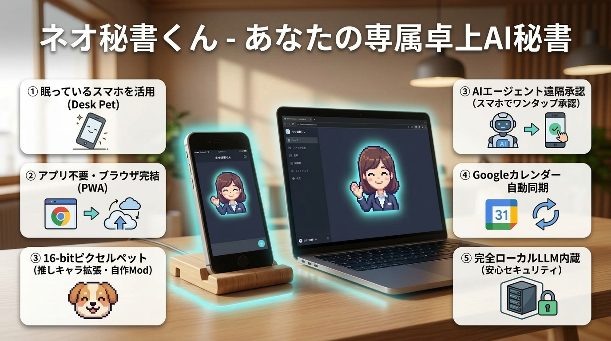
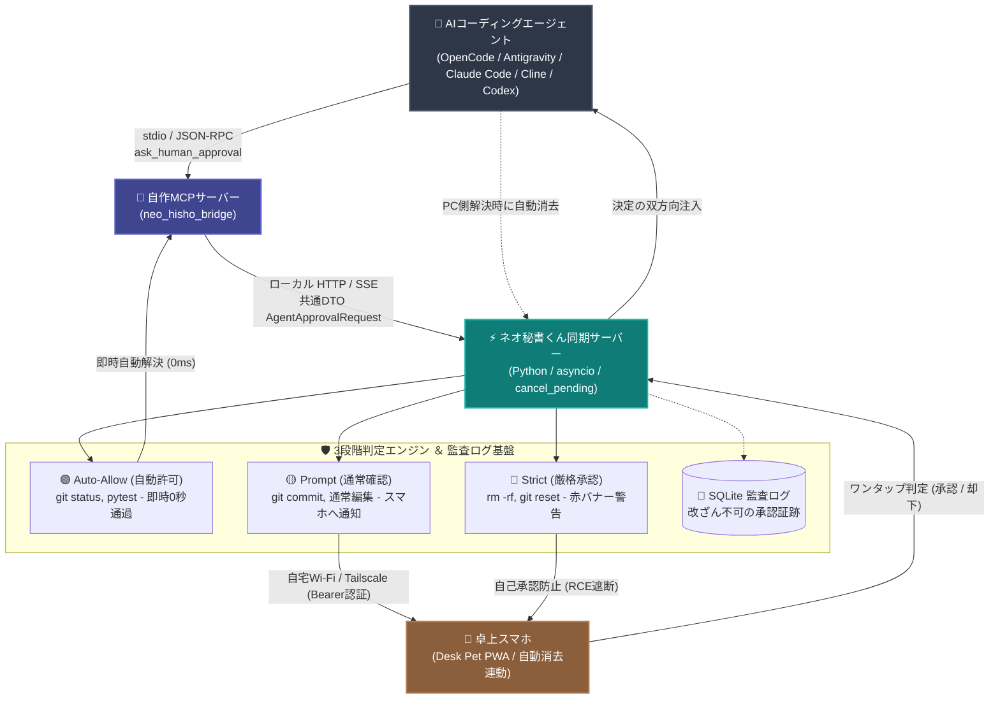

# ネオ秘書くん (Neo-Secretary) 🐾

[](https://github.com/Siitake-man/hisho-kun/actions/workflows/ci.yml)

[](https://www.python.org/)
[](https://github.com/Siitake-man/hisho-kun/releases/tag/v1.1.18)
[](tests/)
[](README.md)

> 🇬🇧 **English documentation is available!** ➔ Check out [README.md](README.md) for full English guide.  
> ☕ **「電車の中でコードを書くためのモバイルIDEではありません。休日に自律AIを走らせ、リビングで家族と過ごしながら、必要な1秒だけを救い上げるための生活空間のアンビエントな気付き装置です。」**

### 📱 引き出しで眠る古いスマホが、AI開発の「卓上スマート相棒」に化ける。

**ネオ秘書くん (Neo-Secretary)** は、使わなくなったスマートフォンをQRコード1発で**「Desk Pet（卓上スマート秘書）」**へと生まれ変わらせるデスクトップ常駐AIアシスタントです。

**OpenCode, Antigravity, Claude Code, Cline, Cursor, Codex** などの自律AIコーディングを回しながら、**「離席中に『コマンド実行していい？』で停止して開発が進まない…」**という経験はありませんか？  
ネオ秘書くんなら、PC右下のドット絵ペットがAIの思考とリアルタイムに連動し、離席中でも**手元のスマホからワンタップで遠隔承認（双方向注入）**。さらにPC側で先に操作した場合は**スマホ側の保留カードが自動消去**されるため、カードが画面に残り続ける煩わしさもありません。

<p align="center">
  
</p>

<p align="center" style="margin: 24px 0;">
  <a href="https://siitake-man.github.io/hisho-kun/neo-secretary-showcase.html">
    
  </a>
  &nbsp;&nbsp;
  <a href="https://siitake-man.github.io/hisho-kun/guides/NEO_HISHO_CHEAT_SHEETS.html">
    
  </a>
  &nbsp;&nbsp;
  <a href="https://github.com/Siitake-man/hisho-kun/releases/tag/v1.1.18">
    
  </a>
</p>

<p align="center">
  
  &nbsp;&nbsp;&nbsp;&nbsp;&nbsp;&nbsp;&nbsp;&nbsp;
  
</p>

<p align="center"><sub>▲ デスクトップやスマホで表情豊かに呼吸し、あなたの仕事を応援します 👔🐬</sub></p>

<p align="center">
  
  &nbsp;&nbsp;
  
  &nbsp;&nbsp;
  
</p>

---

## ⚡ 開発哲学：生活空間のアンビエント気付き ⇆ モバイル重労働からの解放

自律AIコーディングの進捗を離席中に監視しようとする際、既存のツール（Paseo、SSHターミナル共有、モバイルWeb IDE等）は「スマホを小さな開発マシンにしよう」としがちです。  
しかし、**休日に家族と過ごしている時やコーヒーを淹れている最中に、6インチの画面で長大なdiffを読み込み、フリック入力でコマンドを打つのは激しい認知的疲労（消耗）**を生みます。

ネオ秘書くんはその真逆を行きます。**「認知負荷の極小化（1秒のチラ見とワンタップ）」**です。

| 比較軸 | モバイルWeb IDE / ターミナル共有 | 🐾 ネオ秘書くん（アンビエント相棒） |
|---|---|---|
| **主戦場** | 通勤電車 / 外出先のヘビー作業 | **リビング生活空間 / コーヒー休憩 / デスクサイド** |
| **認知負荷** | 高（スマホでdiff精読・ピンチズーム・文字入力） | **極小（1秒で状況把握、ワンタップで即注入）** |
| **主な操作** | スマホ上でのコード編集・コマンド手動入力 | **承認 / 却下 / 質問選択肢のワンタップ回答** |
| **画面の佇まい** | 無機質で冷たい開発者コンソール | **呼吸しリアクションする16-bitドット絵ペット** |
| **通信とプライバシー** | クラウド中継サーバー・外部ポート開放 | **完全ローカルWi-Fi / Tailscale、外部テレメトリ送信ゼロ** |
| **端末の役割** | メインスマホのバッテリーを消耗 | **引き出しに眠る余剰スマホを卓上専用機にアップサイクル** |

### 💡 コアとなる2層統合レイヤー

1. **第1層：透過的ネイティブフック注入 (OpenCode / Antigravity)**  
   ターミナルコマンド実行の直前イベントをインターセプトし、スマホが承認するまで実行を安全にブロック・保留します（LLMの指示忘れによるすり抜けゼロ）。
2. **第2層：FastMCP 標準プロトコルブリッジ (Claude Code / Cline / Cursor / Codex)**  
   内蔵 FastMCP サーバー (`neo_hisho_bridge`) を介して、エージェントが自律的に `ask_human_approval` や `notify_task_completed` を呼び出し、スマホへ即時通知します。

---

## 🏛️ システムアーキテクチャ ＆ データフロー



### 📡 リアルタイム通信データフロー

```text
[ 各種AIエージェント ] (OpenCode / Antigravity / Claude Code / Cline / Codex 等)
       │
       ▼ (stdio / JSON-RPC: Model Context Protocol)
[ 自作 MCPサーバー ] (neo_hisho_bridge)
       │
       ▼ (ローカル HTTP / 共通DTO AgentApprovalRequest)
[ ネオ秘書くん同期サーバー ] (Python / asyncio)
       │ ├─ 🟢 Auto-Allow : 安全な閲覧・テストコマンドは即時0秒で自動通過
       │ ├─ 🟡 Prompt     : 通常編集・コミットはスマホへ通知
       │ ├─ 🔴 Strict     : 破壊的変更は深紅の警告パルスバナーを発火
       │ ├─ 🔄 双方向注入 : スマホでのタップ決定をエージェントへ直接注入
       │ ├─ 🚫 自動取消   : PC側で操作完了時にスマホ通知を即座に消去 (cancel_pending)
       │ └─ 📝 Audit Log  : 全承認履歴をSQLiteに監査証跡として完全保存
       ▼ (自宅Wi-Fi / Tailscale: Bearer認証 ＆ 自己承認RCE遮断)
[ 卓上スマホ (Desk Pet) ] 📱「ベッドやキッチンからワンタップでポチッ！」
```

## ✨ 機能一覧

| 機能 | 説明 |
|---|---|
| 🤖 **AI秘書ペット** | PC右下に常駐。ドット絵アニメーション（秘書くん＋案内精霊カイル、設定から切替可能） |
| 📱 **スマホ連携 (PWA)** | QRコードを読むだけでペアリング。タスク・手帳・習慣をスマホから操作 |
| 🔔 **双方向承認ブリッジ** | OpenCode / Antigravity / Claude Code 等の確認をスマホへ通知、ワンタップで決定注入 |
| 🚫 **PC操作連動消去** | PC側で許可/選択を完了した場合、スマホ画面の待機カード・シートを自動消去 |
| 🔀 **パラパラ送りカルーセル** | TODO・予定・ニュースヘッドラインが20秒ごとに自動ローテーション |
| 📅 **カレンダー連携** | Googleカレンダーの秘密iCal URLを読み取り（OAuth不要・読み取り専用） |
| ☀️ **リアル天気** | 現在地の天気を自動取得。雨の日は画面に雨粒エフェクト |
| 🌈 **生活ドリーマー** | AIがペットの生活（食事・お風呂・読書・睡眠）を自動生成 |
| 🍅 **ポモドーロタイマー** | 集中タイマー。ペットが集中モードに変化 |
| 📣 **朝会/終礼ブリーフィング** | 朝は今日の予定・TODO・天気を音声付きで報告。夜は日報 |
| 👾 **シークレット要素** | 「お前を消す方法」と話しかけると…グリッチ演出と隠しミニゲーム（Pixel Defense）が解放 |
| 📴 **オフラインAI同梱** | LFM2.5 (Liquid AI) をローカル推論。APIキー無し・完全オフラインで会話可能 |

---

## 🚀 クイックスタート

### 必要なもの
- **Windows PC**（Python 3.11以上）
- **スマートフォン**（iOS / Android。PWA対応ブラウザ）
- **Wi-Fi**（PCとスマホが同じネットワークに接続）

### 1. ダウンロード＆インストール

```bash
# リポジトリをクローン
git clone https://github.com/Siitake-man/hisho-kun.git
cd hisho-kun

# 仮想環境を作成
python -m venv venv

# 仮想環境を有効化
venv\Scripts\activate

# 依存パッケージをインストール
pip install -r requirements.txt
```

### 2. 環境設定

`.env.example` をコピーして `.env` を作成し、APIキーを設定します：

```bash
copy .env.example .env
# メモ帳などで .env を開き、使用するLLMのAPIキーを記入
```

**最低限必要なもの**: いずれか1つのAPIキー
- OpenCode GO（推奨・安価格）
- Google Gemini（無料枠あり）
- OpenAI / Anthropic / Groq 等

### 3. 起動

```bash
venv\Scripts\python.exe main.py
```

PC画面右下にペットが現れます 🎉

### 4. スマホとペアリング

1. PCのペットを **右クリック → 📱 スマホ接続**
2. QRコードが表示されます
3. **スマホでQRコードを読み取る**
4. スマホにペット画面が表示されれば完了！

---

## 📴 オフラインAI同梱 (LFM2.5)

APIキーがなくても、PC内で完結するローカルAIと会話できます。
`start.bat` 初回起動時にモデルが未ダウンロードなら、自動的にセットアップを案内します。

### モデルの選択

| モデル | サイズ | おすすめ環境 |
|---|---|---|
| ⭐ **超軽量モード** (LFM2.5-350M QAD-Q4_0) | 約230MB | 大体のPCでサクサク動く推奨サイズ |
| **高品質モード** (LFM2.5-1.2B-Instruct QAD-Q4_0) | 約770MB | 4GB RAM以上。より賢い応答 |

手動でセットアップする場合:

```bash
python tools/setup_local_model.py              # 対話式で選択
python tools/setup_local_model.py --model 1.2b # 高品質モードを直接指定
```

セットアップ後は `.env` に `DEFAULT_LLM_PROVIDER=local_gguf` が自動設定され、次回起動からオフラインAIが有効になります。
設定画面や `.env` でいつでもクラウドLLMへ切り替え可能です。

> 📄 **モデルクレジット**: 本プロダクトは [Liquid AI](https://liquid.ai) の **LFM2.5** を使用しています。
> モデルは **LFM Open License v1.0** の下で提供されています（[ライセンス全文](https://huggingface.co/LiquidAI/LFM2.5-350M-GGUF/blob/main/LICENSE)）。

---

## 📖 スマホの使い方

| 操作 | 方法 |
|---|---|
| キャラ切替 | ⚙️ 設定 → 🎭 キャラクター切り替え |
| 🎨 テーマ変更 | 書斎→カフェ→森→海→サイバー |
| 常時画面ON | ⚙️ 設定 → 💡 常時画面ON |
| 全画面表示 | ⛶ ボタン |
| 手帳（予定・TODO） | 📝 ボタン |
| ポモドーロ | 🍅 ボタン |

---

## 🔗 Google カレンダー連携（オプション）

1. PC版 Googleカレンダーを開く
2. 左のカレンダー名「⋮」→「設定と共有」
3. ページ下までスクロール→「秘密のiCalアドレス」のURLをコピー
4. ネオ秘書くん設定 → 外部ツールタブ → iCal URL欄に貼り付け
5. 「今すぐ同期」

> ⚠️ **読み取り専用**です。スマホからの予定追加はローカルのみで、Googleカレンダーへは反映されません。

---

## 🌐 外出先からの接続（Tailscale）

スマホが同じWi-Fiにいない場合も、Tailscale VPN で接続できます：

1. PCとスマホに **Tailscale** をインストール
2. 同じアカウントでサインイン
3. PC側で管理者PowerShellから `tailscale serve 8765` を実行（初回のみ。`8765` は既定ポートで、`NEO_HISHO_PORT` で変更した場合はその値に読み替え）
4. `main.py` を起動 → QR接続ダイアログ →「Tailscale VPN経由」のQRをスマホで読取

---

## 🤖 AIエージェント連携：30秒配線ガイド

お使いのAIコーディングエージェントとネオ秘書くんを接続するには、**自動セットアップ（推奨）** または **手動設定スニペット** のいずれかを選択してください。

### 方法1：自動ワンライナー（推奨）

自動インストーラーを実行すると、PC内のエージェント設定ファイルを自動検出し、安全なバックアップを作成した上で登録を完了します：

```bash
venv\Scripts\python.exe mcp_installer.py --all
```

- **対応クライアント**: OpenCode / Antigravity / Claude Code / Claude Desktop / Cursor / Cline / VS Code
- 既存の設定は上書きされず、`neo_hisho_bridge` のみが安全にマージされます。

---

### 方法2：設定ファイル直接記述（30秒）

手動で設定する場合は、お使いのエージェントの設定ファイルに以下のスニペットを追記してください。

> 💡 **パス指定の重要な注意点**:
> - JSON内のパス区切り文字には、必ずスラッシュ（`/`）を使用してください（Windowsのバックスラッシュによるエスケープエラーを防止）。
> - 実行コマンドには必ず仮想環境内のPython（`venv/Scripts/python.exe`）をフルパスで指定し、引数に `hisho_mcp_server.py` の絶対パスを渡してください。`cwd`（カレントディレクトリ）に依存した指定は避けてください（WindowsのClaude Code等において `cwd` がサイレントに無視される不具合を防止 — 参照: [anthropics/claude-code#54786](https://github.com/anthropics/claude-code/issues/54786)）。

#### 1. Claude Code (`~/.claude.json` または `.mcp.json`)
```json
{
  "mcpServers": {
    "neo_hisho_bridge": {
      "command": "C:/path/to/hisho-kun/venv/Scripts/python.exe",
      "args": ["C:/path/to/hisho-kun/hisho_mcp_server.py"]
    }
  }
}
```

#### 2. Cursor (`.cursor/mcp.json`)
```json
{
  "mcpServers": {
    "neo_hisho_bridge": {
      "command": "C:/path/to/hisho-kun/venv/Scripts/python.exe",
      "args": ["C:/path/to/hisho-kun/hisho_mcp_server.py"]
    }
  }
}
```

#### 3. Cline (`cline_mcp_settings.json`)
- **VS Code 拡張機能の設定パス**: `%APPDATA%/Code/User/globalStorage/saoudrizwan.claude-dev/settings/cline_mcp_settings.json`
- **Cline CLI の設定パス**: `~/.cline/data/settings/cline_mcp_settings.json`

```json
{
  "mcpServers": {
    "neo_hisho_bridge": {
      "command": "C:/path/to/hisho-kun/venv/Scripts/python.exe",
      "args": ["C:/path/to/hisho-kun/hisho_mcp_server.py"]
    }
  }
}
```

#### 4. OpenCode 原生インターセプター (`.opencode/plugins/` または グローバルフック)
LLMの指示忘れによるすり抜けを防ぎ、ターミナル実行直前でコマンドを決定論的にブロック・保留する場合：
```bash
# 実行前フックをOpenCodeプロジェクトへ直接配備
venv\Scripts\python.exe tools/install_opencode_hook.py
```

> 💡 **内部での動作の仕組み**:
> - **OpenCode 原生フック**: シェル実行イベントを捉えてネオ秘書くん (`POST /api/agent/approval`) へ通知し、スマホで許可されるまでターミナルをブロック待機させます。
> - **FastMCP ツール**: エージェントが自律的に `ask_human_approval`、`notify_task_completed`、`remember_boss_insight` を呼び出すと、ネオ秘書くんのキューへ入り各端末へ即座に同期されます。

---

## 🔔 アップデート確認について

ネオ秘書くんは起動時と約6時間ごとに **GitHub Releases** へアクセスし、新しいバージョンが公開されていないかを確認します（読み取り専用・テレメトリ送信ゼロ）。

---

## 🗂️ プロジェクト構成

```
ネオ秘書くん／
├── main.py                 # メイン起動ファイル
├── version.py              # バージョン定義 (Single Source of Truth・各所は本値を参照)
├── update_checker.py       # 更新チェック (GitHub Releases・通知のみ)
├── gui.py                   # PCペットUI
├── agent.py                  # LangGraph エージェント
├── life_dreamer.py           # 自律生活生成エンジン
├── weather_tools.py          # リアルタイム天気取得
├── local_sync_server.py      # スマホ連携・同期サーバー (cancel_pending API)
├── database.py               # データベース操作
├── ui／                      # Tkinter UI 部品
├── web_pet／                 # スマホPWA フロントエンド (自動消去 & カルーセル)
├── assets／dot／              # ドット絵アセット（2キャラ: 秘書くん／カイル）
├── tools／                    # 開発ツール類
├── tests／                    # テストスイート (980+ passed)
├── docs／                     # ドキュメント
└── .env.example               # 環境設定テンプレート
```

---

## 📄 ライセンス

MIT License — 詳細は [LICENSE](LICENSE) を参照してください。

---

*ネオ秘書くん — あなたのデスクトップに住む AI 秘書ペット 🤖✨*
