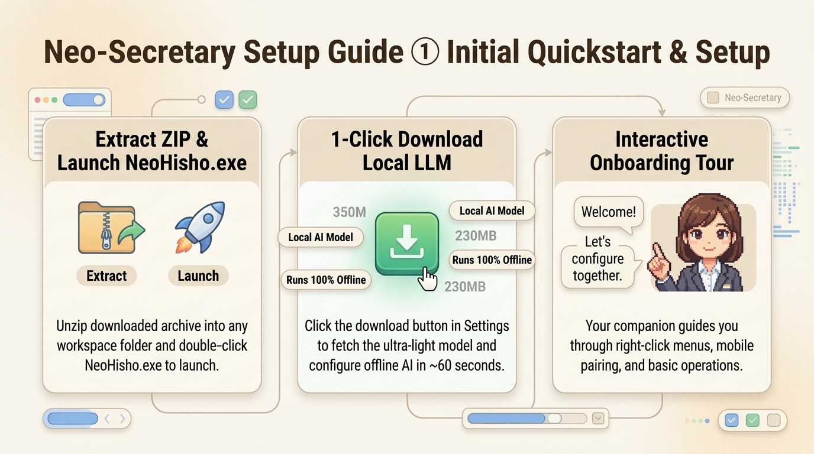

# 📘 Neo-Secretary Cheatsheet ① [Initial Setup & Quickstart]
*Last Updated: 2026-09-13*

Fast-track guide to downloading, starting, and configuring Neo-Secretary in under 2 minutes.

  

---

## 🚀 1. Launching Neo-Secretary (2 Quick Steps)

1. **Extract Distribution Archive**
   - Unzip `NeoHisho_v1.0.0_win64.zip` into your preferred local workspace folder.
2. **Double-click `NeoHisho.exe` (or `start.bat`)**
   - Your cute retro pixel companion (Hisho or Kyle) will appear in the bottom-right corner of your monitor!
   - *Note: On first launch, an interactive Onboarding Tour automatically starts to guide you through menus and key features.*

---

## 🔒 2. Zero-Config Air-Gapped Privacy Mode (Recommended)

To use the assistant completely offline without external cloud API keys or telemetry leaks:

1. Right-click the companion ➔ select **"⚙️ Settings"**.
2. Navigate to the **"🧠 AI Model"** tab, find the **"Embedded Local LLM"** card.
3. Click the **"⚡ Download Ultra-Lightweight Model (350M / ~230MB)"** button.
4. The model downloads in ~1 minute and configures `DEFAULT_LLM_PROVIDER=local_gguf` automatically. Full offline conversational reasoning is now live!

---

## ⚙️ 3. Settings Window Overview (4 Core Tabs)

| Settings Tab | Primary Function | Ideal Use Case |
| :--- | :--- | :--- |
| **🧠 AI Model** | Switch between Ultra-Light Local GGUF, Google Gemini, Anthropic Claude, and OpenCode | Offline privacy or high-speed cloud reasoning |
| **🤖 External AI / MCP** | 1-click register to Antigravity, Claude Code, Cline, and Codex; manage custom MCP servers | Remote coding agent command approvals |
| **📅 External Tools** | Google Calendar read-only sync (iCal), Tailscale remote hostname, GitHub | Daily schedule timeline & mobile remote access |
| **📖 User Guide** | Self-diagnostics, interactive tour replay, shortcut cheatsheets | Troubleshooting and comprehensive reference |

---

## 💡 Need Quick Assistance?
- Open the companion chat bubble and ask: **"How do I set up calendar sync?", "How do I connect my phone?", or "What is agent approval?"** Your companion will guide you through step-by-step!
