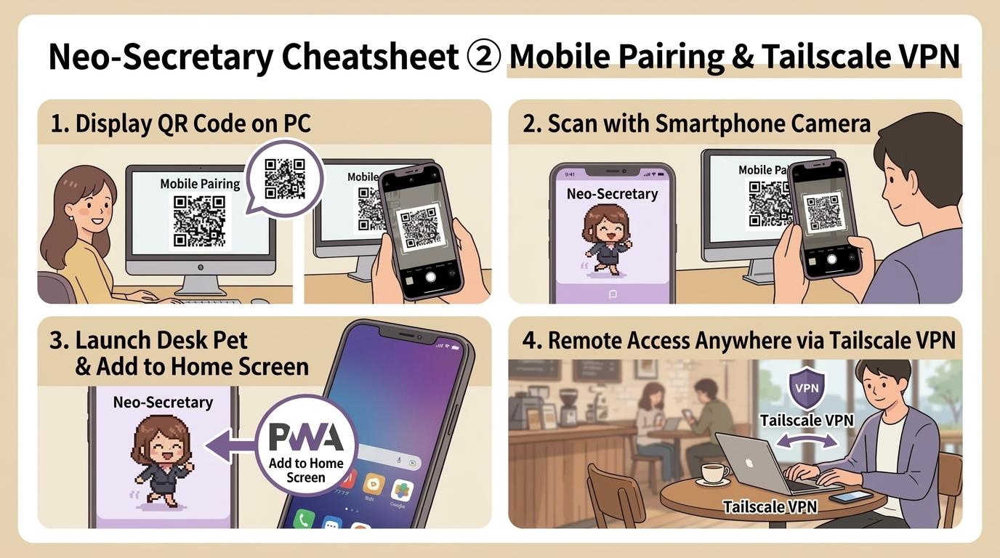

# 📱 Neo-Secretary Cheatsheet ② [Mobile Pairing, QR & Tailscale VPN]
*Last Updated: 2026-09-13*

Turn your unused smartphone into a live desktop cockpit and smart Desk Pet.
Zero app store installations required—runs entirely in mobile Safari / Chrome as a lightweight PWA!

<p align="center">
  
</p>

---

## 📲 1. Basic: Local Wi-Fi Connection (3 Quick Steps)

When your PC and smartphone are connected to the exact same home or office Wi-Fi:

```
[PC] Right-click ➔ "📱 Mobile Desk Pet" ➔ [Phone] Scan QR with camera ➔ [Phone] Opens live in browser!
```

1. **Open QR Code on PC**
   - Right-click your desktop companion ➔ select **"📱 Mobile Desk Pet (Show QR)"**.
2. **Scan QR Code with Smartphone Camera**
   - Open standard Camera on iOS / Android, tap the recognized URL to open in Safari / Chrome.
3. **Desk Pet is Live!**
   - Instantly pairs with your PC over encrypted Zero-Trust Bearer authentication. Your pixel mascot starts breathing and walking on your phone!

---

## 🌐 2. Advanced: Remote Access via Tailscale VPN (Coffee Shops / Cellular)

To connect from coffee shops, cellular LTE/5G, or guest networks with AP client isolation:

```
[Prerequisite: Install Tailscale on PC & Phone] ➔ [Run `tailscale serve 8765` on PC (default port — use NEO_HISHO_PORT if customized)] ➔ [Access remotely anywhere!]
```

### 3-Step Tailscale Setup
1. **Install Tailscale (Free Mesh VPN) on PC and Smartphone**
   - Sign in with the same account and turn VPN on on both devices.
2. **Run Tailscale Serve Command on PC Terminal**
   ```powershell
   tailscale serve 8765
   ```
3. **Save Tailscale Hostname in Neo-Secretary Settings**
   - Open Settings (⚙️) ➔ **"📅 External Tools"** tab ➔ **"🌐 Remote Access (Tailscale VPN)"**. Enter your machine hostname (e.g., `my-pc.tailXXXX.ts.net`) and click **"💾 Save"**.
   - 👉 The QR dialog will now display a dedicated **"🌐 Remote Tailscale URL"** for instant connection from outside!

---

## ⭐ 3. Pro Tip: "Add to Home Screen" (Full-Screen PWA Mode)

Eliminate browser address bars and run Neo-Secretary as a distraction-free native desktop display:

* **iPhone (Safari)**: Tap Share icon ➔ **"Add to Home Screen"**
* **Android (Chrome)**: Tap `︙` menu ➔ **"Add to Home screen"** or **"Install app"**

👉 Prop your phone on a charging stand next to your keyboard. You now have a dedicated, always-on AI Desk Approval Cockpit!

---

## ❓ Troubleshooting Checklist
- [ ] Is Neo-Secretary running on your PC? (Default background listener port: 8765)
- [ ] Are PC and phone on the same Wi-Fi? (If on separate networks, ensure Tailscale VPN is connected on both)
- [ ] Did Windows Defender Firewall prompt appear? (Click "Allow access for Private Networks")
