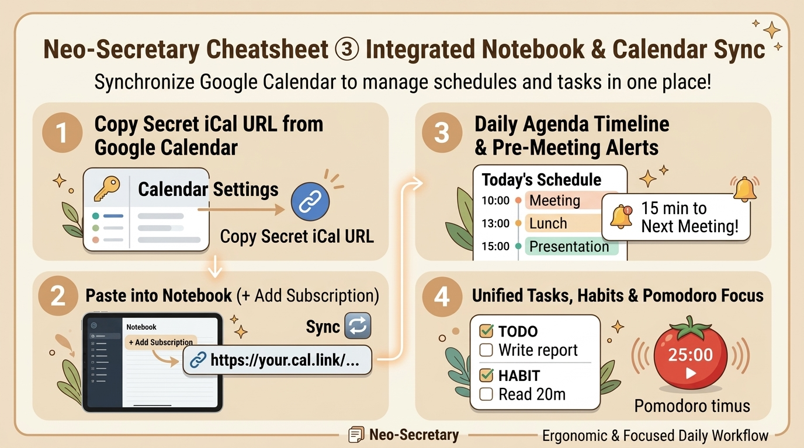

# 📔 Neo-Secretary Cheatsheet ③ [Integrated Notebook & Calendar Sync]
*Last Updated: 2026-09-13*

Unified guide to schedule management, task tracking, habit formation, and 3-line positive journaling.

<p align="center">
  
</p>

---

## 📅 1. Google Calendar Integration (Read-Only Secret iCal URL)

Syncing with Google Calendar enables automated timeline briefings and proactive pre-meeting reminders ("Boss, your Sync Meeting starts in 15 minutes!").
*Note: Uses read-only public/secret iCal URLs with zero Google passwords or OAuth tokens required.*

```
[Google Calendar Web] ➔ [Settings] ➔ [Select Calendar] ➔ [Integrate Calendar] ➔ [Copy Secret iCal URL]
```

### 4-Step Setup Procedure
1. **Open Google Calendar in Web Browser**
   - Click the ⚙️ **"Settings"** icon in the upper right.
2. **Select Calendar from Left Sidebar**
   - Under "Settings for my calendars", click your primary or work calendar.
3. **Scroll to "Integrate calendar" Section**
   - Locate **"Secret address in iCal format"** and copy the URL (`https://calendar.google.com/calendar/ical/.../basic.ics`).
4. **Paste into Neo-Secretary & Synchronize**
   - Right-click companion ➔ **"📔 Integrated Notebook"** ➔ click **"＋ Add Subscription"**.
   - Paste the iCal URL and click **"🔄 Sync All"**. Done!
   - *Note: Background sync automatically refreshes every 30 minutes.*

---

## 📝 2. 4 Core Notebook Capabilities

Access the **"📔 Integrated Notebook"** from right-click menus to organize your daily work:

1. **📋 Daily Timeline**: Chronologically interleaves Google Calendar events with scheduled task deadlines.
2. **✅ Task List & Natural Language Quick-Add**:
   - Type phrases like `Submit quarterly report tomorrow at 5pm #finance !3` in the chat input. AI parses due date, tag, and priority (!1 to !3) instantly.
3. **🌱 Micro-Habit Tracker**: Check off daily routines (Hydrate, Posture check, Code review). Your companion cheers with joyful animations!
4. **📖 3-Line Positive Reflection**: Quick end-of-day retrospectives. AI provides warm, constructive feedback.

---

## 🍅 3. Pomodoro Focus Timer

- Select **"🍅 Start Pomodoro"** from menu.
- Cycles through **25 min Focus ➔ 5 min Rest**.
- During focus, your companion switches into high-alert concentration posture. Breaks trigger gentle tea suggestions 🍵.
