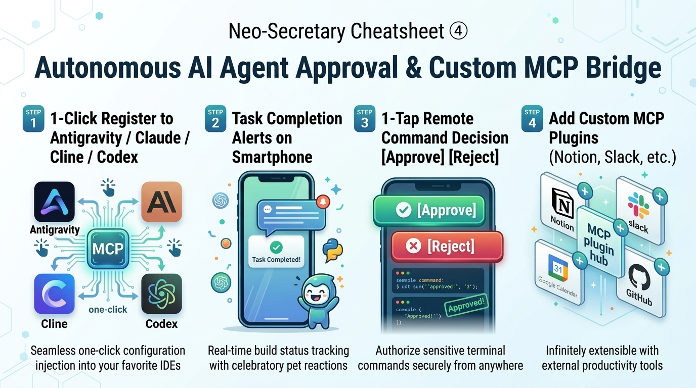

# 🤖 Neo-Secretary Cheatsheet ④ [AI Coding Agent Approval & Custom MCP]
*Last Updated: 2026-09-13*

**The killer feature for software engineers and AI builders!**
Bridge autonomous coding agents (Claude Code, Cline, Cursor, Antigravity, Codex) with your mobile phone.
Review and authorize CLI terminal commands with one tap from anywhere, plus connect arbitrary MCP servers.

<p align="center">
  
</p>

---

## 🎯 1. Why This Changes Everything (Developer Freedom)

While delegating heavy implementation tasks to autonomous AI agents, developers face two major friction points:
- "I can't step away from my desk because the agent might prompt for command permission (`git push`, `npm test`) at any moment."
- "The agent finished 30 minutes ago, but I didn't notice, leaving the build completely idle."

👉 **Neo-Secretary watches your agent's execution output in real time and pushes instant alerts to your phone! Approve commands with a single tap from your kitchen or couch!**

```
[Autonomous AI Agent (Claude Code / Cline / Cursor / Antigravity)]
       │
       ▼ (MCP Bridge: neo_hisho_bridge)
[Neo-Secretary (PC Host)]
       │
       ▼ (Real-Time Encrypted Sync)
[Mobile Desk Pet (PWA)] 📱 "Boss! Command approval needed! [Approve] [Reject]"
       │
       └─► Tap [Approve] on mobile ➔ AI agent immediately resumes execution on PC!
```

---

## 🛠️ 2. 30-Second Agent Registration Guide

Open Settings (⚙️) ➔ **"🤖 External AI / MCP"** tab to configure your IDEs with one click:

| Target Agent / Tool | Registration Method |
| :--- | :--- |
| **Antigravity** | Click **"🚀 Auto-Register to Antigravity"** (Injects configuration JSON directly into settings). |
| **Claude Desktop / Cursor** | Click **"📋 Copy MCP Config JSON"** ➔ paste into `claude_desktop_config.json` or Cursor settings. |
| **Codex** | Click **"📋 Copy Codex TOML"** ➔ paste into `config.toml`. |
| **Claude Code** | Click **"📋 Copy Claude Code Command"** ➔ paste and run in terminal. |

---

## 🔔 3. 3 Mobile Notifications & Remote Actions

1. **🎉 Task / Sprint Completion Celebrations**:
   - The second your agent finishes unit tests or completes code generation, your mobile mascot triggers joyful confetti and bounce animations!
2. **🛡️ Command Approval Checks (3-Tier Policy)**:
   - Safe commands (`git status`, `cargo check`) auto-approve in 0ms.
   - Standard edits push polite alert banners. Destructive commands (`rm -rf`, `push --force`) pulse in crimson warnings for strict mobile review.
3. **❓ Clarification & User Input Prompts**:
   - When an agent requests clarification or multiple-choice input, select answers directly on your mobile screen.

---

## ➕ 4. Connecting Custom External MCP Servers

Neo-Secretary allows you to attach any external MCP servers (Notion, Slack, GitHub, PostgreSQL) to expand your assistant's tool suite infinitely.
Configure extra servers via the Settings dialog or `mcp_config.json`.
