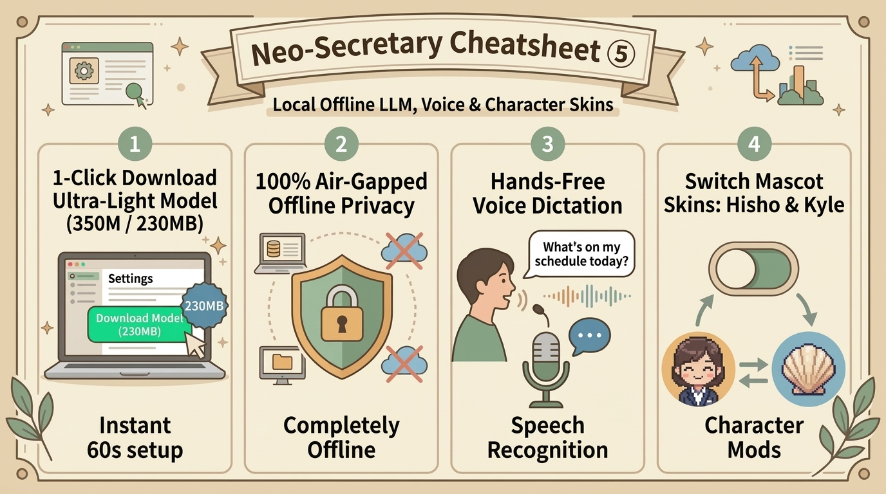

# 🔒 Neo-Secretary Cheatsheet ⑤ [Local Offline LLM & Character Skins]
*Last Updated: 2026-09-24 23:50 (Voice-input section replaced: built-in speech recognition removed — use the smartphone OS keyboard microphone)*

Guide to operating high-privacy local LLMs without external APIs and customizing pixel mascot character skins.

<p align="center">
  
</p>

---

## 🔒 1. 1-Click Embedded Ultra-Light Model (Liquid AI LFM2.5)

To operate in strict air-gapped security without transmitting code or notes outside your local PC:

```
[Settings ⚙️] ➔ [🧠 AI Model] ➔ [⚡ Download Ultra-Lightweight Model (350M)]
```

- **Architecture**: Liquid AI's cutting-edge LFM2.5 (350M, Quantization-Aware Distilled).
- **Disk Size**: Only ~230MB. Runs smoothly even on standard laptop CPUs with zero GPU requirements.
- **Privacy Guarantee**: 100% local inference with zero internet connection needed.

---

## 💻 2. Connecting External Local LLM Runners (LM Studio / Ollama)

If you prefer larger local weights (7B, 14B, or 32B), Neo-Secretary connects seamlessly to local servers:

| Runner Tool | Connection Setup |
| :--- | :--- |
| **LM Studio** | Start local server in LM Studio (`http://localhost:1234/v1`) ➔ Specify endpoint in Neo-Secretary Settings. |
| **Ollama** | Run `ollama run qwen2.5-coder:7b` in terminal ➔ Select Ollama provider in Settings. |

---

## 🎤 3. About Voice Input

For voice text entry, please use the microphone on your smartphone's standard OS keyboard (the built-in speech recognition feature has been removed).

---

## 👔 4. Character Skins & Pixel Art Mascot Mods

Tailor your desktop companion's appearance and persona to your mood:

| Character Skin | Persona & Style | Recommended Scenario |
| :--- | :--- | :--- |
| **👔 Hisho (Executive Assistant)** | Loyal, precise, polite. Optimizes developer focus and time allocation. | Daily professional workflows and deep focus sprints |
| **🐚 Kyle (Shell Spirit)** | Retro nostalgic sea shell spirit typing away on a miniature clam-shell terminal. | Casual coding sessions and exploratory hacking |

### Dropping in Custom Mascot Mods
Create a folder inside `assets/characters/<your_mascot_name>/` containing `idle.png`, `talk.png`, and `happy.png`. Select your new companion from Settings!
