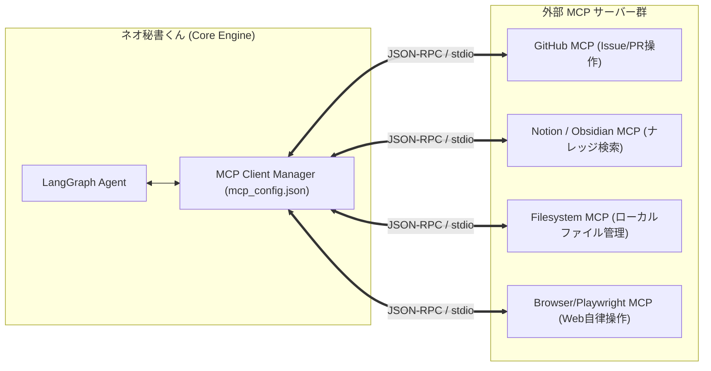
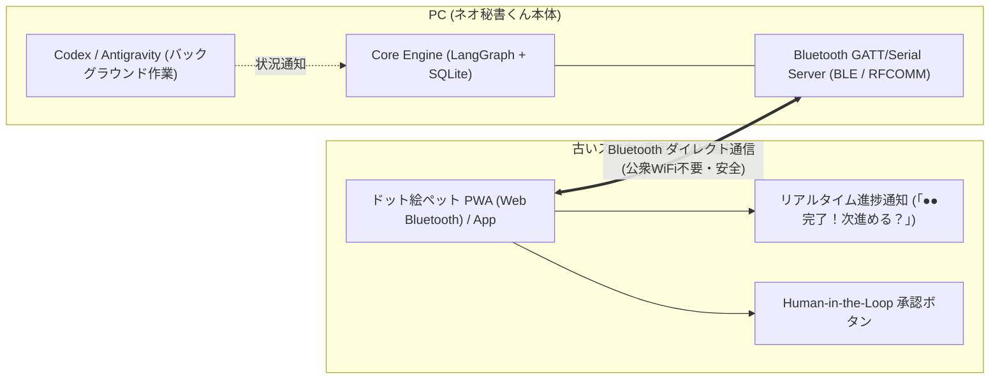

# システム設計書: Neo-Secretary (秘書くん3) Python Agent Edition

**Based on**: 秘書くん Modern 設計書 (by Manus AI) v1.0.0
**Architecture**: Python Desktop App with LangGraph

## 1. プロジェクトの定義
Manusが設計した「秘書くん Modern (Web版)」の機能とデザイン美学を、Python/TkinterおよびLangGraphを用いた「自律型デスクトップエージェント」として再実装（ポーティング）する。

### コア・コンセプト
1.  **Retro Modern UI:** ドットフォント(DotGothic16)とブラウン系配色を用いた「懐かしくも新しい」デザイン。
2.  **Local First & Agentic:** クラウド（Web）ではなくローカルPCに常駐し、ユーザーのコンテキストを理解して自律的に動く。
3.  **Educational:** AIラボでの学習用教材として、LangGraphによるステートマシン制御を実装の中心に据える。

## 2. エージェント・アーキテクチャ (LangGraph & Multi-LLM Factory)

### 2.1 Multi-LLM Factory (動的モデル切り替え)
OpenAI互換プロトコルを活用し、用途に応じてLLMバックエンドを動的に切り替えるファクトリ層を導入する。
- **OpenCode GO (DeepSeek-Flash / V3 / R1)**: 爆速・高精度のクラウド推論（日常のメイン頭脳）
- **LM Studio (Local LLM)**: ローカル完結・完全オフライン・機密保護
- **Google Gemini (Gemini 2.5 Flash)**: クラウド標準バックエンド
- **動的切り替え**: UI上の右クリックメニューから即座に切り替え可能。

### 2.2 State Definition (Graphの状態)
エージェントは以下の状態を持ち回る。
- `messages`: 会話履歴 (HumanMessage, AIMessage, ToolMessage)
- `current_plan`: 現在実行中のタスク計画
- `user_approval`: 承認ステータス (Pending/Approved/Rejected)
- `vision_context`: 画面認識データ（スクリーンショット・OCR・UI解析結果）

### 2.3 MemorySaver (記憶の永続化)
最新のLangGraphに搭載された `MemorySaver` (Checkpointer) を用いて、会話の文脈を永続化する。

### 2.4 Workflow (Nodes & Edges)
1.  **Planner Node:** ユーザーの入力や時間トリガー、画面状況からツール呼び出しを自律判断。
2.  **Executor Node (Tools):** DB操作、カレンダー、付箋、画面認識、外部エージェント連携を実行。
3.  **Human Review Node:** 重要な操作（削除、外部送信等）の前にユーザーの承認を待機。

### 2.5 非同期処理の堅牢化 (Async Native)
`asyncio` を用いて、UIの描画ループとLLM推論・ツール実行を完全に分離し、UIフリーズをゼロにする。

## 3. データベース設計 (SQLite)
Manusの設計をSQLite用に正規化して採用する。

### Table: events (予定)
- `id`: INTEGER PK
- `title`: TEXT
- `description`: TEXT
- `start_time`: INTEGER (Unix Timestamp ms)
- `end_time`: INTEGER (Unix Timestamp ms)
- `recurrence_type`: TEXT ('none', 'daily', 'weekly', 'monthly_date', etc.)
- `recurrence_rule`: JSON
- `category_id`: INTEGER FK
- `google_event_id`: TEXT

### Table: sticky_notes (付箋)
- `id`: INTEGER PK
- `content`: TEXT
- `color`: TEXT (Hex)
- `position_x`: INTEGER
- `position_y`: INTEGER
- `width`: INTEGER
- `height`: INTEGER
- `is_minimized`: BOOLEAN

### Table: categories (カテゴリ)
- `id`: INTEGER PK
- `name`: TEXT
- `color`: TEXT
- `icon`: TEXT

### Table: tasks (TODOタスク)
- `id`: INTEGER PK
- `title`: TEXT
- `description`: TEXT
- `due_date`: INTEGER (Unix Timestamp ms)
- `priority`: INTEGER (0: なし, 1: 低, 2: 中, 3: 高)
- `status`: TEXT ('inbox', 'todo', 'in_progress', 'completed')
- `parent_id`: INTEGER (サブタスク用)

### Table: user_insights (MentisDB型 ユーザー長期知見テーブル - 新規追加)
- `id`: INTEGER PK
- `category`: TEXT ('Constraint': 制約, 'Preference': 好み, 'Habit': 習慣, 'Project': PJルール)
- `content`: TEXT (例: '平日夜は家族のケアサポートのため予定を入れない')
- `context_tags`: TEXT (例: 'schedule, family, time')
- `importance`: INTEGER (1〜5)
- `created_at`: INTEGER (Unix Timestamp ms)
- `updated_at`: INTEGER (Unix Timestamp ms)

## 4. UI/UXデザイン仕様 (ドット絵ペット常駐 ＆ レトロモダン)

### デザインテーマ
- **ペットビジュアル**: **ドット絵・レトロスプライトアニメーション**（待機・思考中・喜び・眠い等の状態に応じたリアクション）
- **配色:** Primary: `#A67B5B` (ブラウン) / BG: `#F5F5DC` (クリーム) / Text: `#4A3B32` (ダークブラウン)
- **フォント:** `DotGothic16` (ドット文字)
- **常駐挙動:**
  - 画面隅へのオートハイド（自動隠蔽）＆ マウスホバーでスライド出現
  - ドラッグ＆ドロップでデスクトップ上の自由な位置へ移動
  - 右クリックメニュー ＆ 吹き出し「⚙」ボタン（モデル切り替え、設定ダイアログ、カレンダー展開、付箋一覧）

### 画面構成
1. **Desktop Pet Window**: 透過ウィンドウ上のドット絵ペット
2. **Speech Bubble (吹き出し)**: レトロ枠線の会話バルーン ＋ 右上「⚙」設定メニュー
3. **Calendar/Task Window**: 手帳風の呼出式ウィンドウ
4. **Settings Dialog (設定画面)**: APIキー・モデルプリセット・Base URLの編集・保存ダイアログ

## 5. 機能要件 (Tools & Engines)

### 5.1 Multi-LLM Factory & Model Presets
代表的かつコストパフォーマンスに優れたモデル群をプリセット提供。
- **OpenCode GO**:
  - `deepseek-chat` (DeepSeek-V3: 爆速・極低コスト・日常対話＆ツール呼び出し)
  - `deepseek-reasoner` (DeepSeek-R1: 複雑なタスク分解・思考プロセス)
- **Google Gemini**:
  - `gemini-2.5-flash` (高速・低コスト・100万トークン大容量コンテキスト)
  - `gemini-2.5-pro` (最高峰推論・アーキテクチャ検討)
- **LM Studio (Local)**:
  - `local-model` (完全オフライン・機密保護・ゼロコスト)

### 5.2 MentisDB型 ユーザー知見蓄積エンジン (Long-Term Memory)
1. **知見の自動抽出**: 会話の中からユーザーの制約・好み・生活リズムを検知し、`user_insights` テーブルへ永続化。
2. **コンテキスト注入**: 推論時に重要度の高い知見（上位5件）をシステムプロンプトへ自動挿入。

### 5.3 Tools for Agent
- **Calendar & Task Manager**: `add_event`, `get_upcoming_events`, `create_task`, `list_tasks`, `complete_task`
- **Sticky Note Manager**: `create_note`, `list_notes`, `update_note`, `delete_note`
- **MentisDB Long-Term Memory**: `remember_user_insight_tool`, `get_user_insights_tool`
- **Vision & Screen Recognition (MiniCPM型)**: `capture_screen()`, `analyze_active_window()`, `locate_gui_elements()`
- **MCP Extensibility**: 外部MCPサーバーから動的に取得された任意ツール群

### 5.4 MCP (Model Context Protocol) クライアント連携アーキテクチャ 🌟
Anthropic提唱の標準規格「MCP」クライアント機能を内蔵し、外部サービス（Notion, GitHub, Google Drive, Slack, Filesystem, Playwright 等）とプラグイン感覚で接続可能にする。

- **設定UI**: 設定ダイアログから `mcp_config.json` を編集・有効化トグル可能。
- **動的ツールバインド**: 起動時に接続されたMCPサーバーのツール定義（JSON Schema）を自動で LangGraph の `tools` リストへ注入。

## 6. スマートフォン専用コンパニオン連携（Desk Pet Device / Bluetoothダイレクト接続）

古いスマートフォン（Android / iOS）を机の傍らに置き、**「外付けスマートディスプレイ／相棒端末」** として活用するアーキテクチャ。
外出先（カフェやコワーキングスペース）での公衆Wi-Fiセキュリティリスク・通信遮断を完全排除するため、**Bluetooth（BLE / RFCOMM）によるダイレクト接続** を採用する。

### 特徴と利点:
1. **公衆Wi-Fi不要（ゼロトラスト＆高セキュリティ）**: PCとスマホがBluetoothで直接1対1通信するため、出先の公衆Wi-Fiやテザリングを介さず安全・確実に動く。
2. **PC作業画面の100%解放**: PCの画面を一切邪魔せず、机の横のスマホ画面上でペットがリアクション。
3. **AIエージェントの作業状況のリアルタイム報告**: CodexやAntigravityの長時間の作業（コーディング・テスト）中にスマホ上で通知・ワンタップ承認。

## 7. MiniCPM と ネオ秘書くん の機能差分 ＆ 取り込み方針 🌟

MiniCPM (MiniCPM-V / MiniCPM-o / OpenBMB Mascot) との比較と、ネオ秘書くんで取り込むべき機能の設計方針。

| 機能軸 | MiniCPM (OpenBMB) | ネオ秘書くん（現在 ➔ 取り込み後） | 取り込み方針 / 実装アプローチ |
| :--- | :--- | :--- | :--- |
| **GUI Grounding (画面要素座標特定)** | 高精度（画面内のボタンや入力欄のピクセル座標を特定） | 🔲 未実装 ➔ **Phase 6で実装** | 画面キャプチャ画像をVisionモデルに渡し、クリックすべき座標を特定して自動操作支援 |
| **リアルタイム画面見守り (Video/Screen Stream)** | 毎秒数フレームの映像を連続処理 | 🔲 未実装 ➔ **定期インターバル監視** | 5分〜10分ごとにアクティブウィンドウをスキャンし「ボス、詰まってませんか？」と声掛け |
| **音声対話 (End-to-End Voice)** | 音声入出力（低遅延ストリーミング） | 🔲 未実装 ➔ **Whisper / TTS連携** | 隙間時間のハンズフリー操作向けに音声入力・読み上げ機能を追加 |
| **長期知見記憶 (MentisDB型)** | なし（セッションごとの対話のみ） | ✅ **完全実装済み** | 秘書くんの独自強み。ボスのルールや生活リズムを永久記憶して賢くなる |
| **MCP 外部アプリ拡張** | なし（モデル単体） | 🌟 **設計追加 (Phase 4)** | GitHub, Notion, Filesystem など無限のツールをプラグイン接続 |

## 8. 将来ロードマップ
1. **Phase 1: デスクトップ常駐MVP [✅ 完了]**
2. **Phase 2: Multi-LLM Factory ＆ 代表的モデル動的選択 [✅ 完了]**
3. **Phase 3: MentisDB型・長期記憶エンジン ＆ ドット絵ペット化 [✅ 完了]**
4. **Phase 4: TODOタスク管理 [✅ 完了] ＆ MCP連携設定機能 [🚧 次期着手]**
5. **Phase 5: Bluetoothダイレクト・スマホ専用ペット端末連携 (Desk Pet)**
6. **Phase 6: MiniCPM型 画面見守り (Vision) ＆ GUI操作支援**

