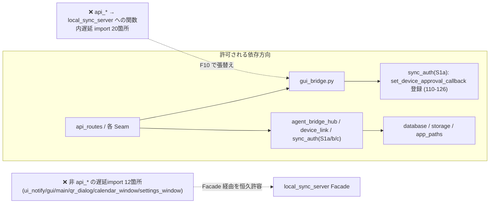
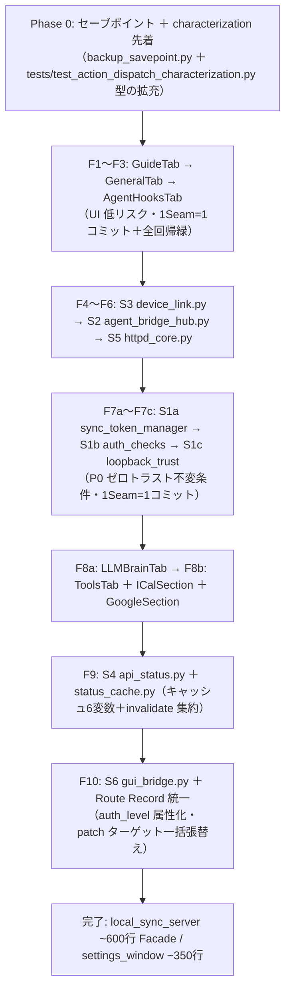

# ネオ秘書くん Fat Module 分割リファクタ設計書（local_sync_server.py ＆ ui/settings_window.py）

- **最終更新**: 2026-09-28 22:59
- **版数**: アプリ **v1.1.16** (🔒 SSOT: `version.py`・版数規約は DESIGN_SPEC §6.0.1) ／ **文書進捗**: Rev 2
- **改訂履歴**: Rev 1（2026-09-28 初版）→ **Rev 2（2026-09-28 22:59）: 独立査読2体の全指摘是正** — devils-advocate（P0×3・P1×4・P2×5・P3×4）／quality-reviewer（P1×3・P2×4・P3×5）。主な是正: patch ターゲット移行表（§6.3.1 新設）・S1 三分割（§3.2）・Route Record `auth_level` 仕様と RCE 遮断の回帰防衛（§5/F10）・ToolsTab 再分割（§3.3）・算術/参照行番号/件数の実測一致
- **担当**: 立案＝task-planner（N4・本体執筆）／解析＝task-planner (N1)・python-architect (N2)・先行事例＝task-planner (N3)／査読＝devils-advocate (N5)・quality-reviewer (N6)
- **手帳 TODO**: **ID 76**（設計書策定）と連携。実装フェーズは本設計書承認後に起票する
- **Non-Goals**: 本設計書は**設計のみ**。コード実装は別フェーズ（roadmap §13.19-33 準拠）

---

## 1. 目的と背景（Why）

Jules 夜間監査（2026-09-27）は、アーキテクチャ軸 **7.5/10** の低評価要因として「God Module の残存」を挙げた（`docs/reports/nightly/nightly_health_and_review.md`）:

| 対象 | 実測行数 | 最大の肥大点 |
|:--|:--|:--|
| `local_sync_server.py` | **2,296行** | `DeskPetSyncHandler` 1,214行（`do_GET` 402行・`_check_auth` 163行・`/api/status` 248行） |
| `ui/settings_window.py` | **1,930行** | `SettingsWindow._build_ui` 973行（実測 284-1256） |

肥大化の害は「修正時の玉突き事故（副作用）」「AI推論オーバーヘッドによるハング」「隙間時間5分でのレビュー困難」（ロードマップ §13.7 実績）であり、本プロジェクトは既に同一病因を 2 回根治している:

- **前例1**: `web_pet/pet.js` 3,335行 → **1,604行**（Seam 5分割・各Seamに単体テスト＋quality-reviewer APPROVED）
- **前例2**: `database.py` 2,498行 → **薄い Facade（実測265行）**（`storage/` Repository 分離・3段階移行）

本設計書は §13.7 の **Seam／Deep Module 原則**を、上記 2 モジュールへ適用する方針・移行手順・テスト戦略を確定する。

---

## 2. 現状分析（実測ベース）

> ⚠️ **行番号の正本は実ファイル実読（N1/N2 レポート・2026-09-28）**。codebase-memory-mcp の一部数値は旧スナップショットの可能性があり、本書では実読値を正本とする（査読 N6 による20箇所以上のサンプリング検証で不一致ゼロ）。

### 2.1 `local_sync_server.py`（2,296行）

#### 2.1.1 責務マップ（4ドメインが直交）

| 区間 | シンボル | 行数 | 責務 | 公開性（inbound 呼出・実測） |
|:--|:--|:--|:--|:--|
| 27-58 | `QuietThreadingHTTPServer` | 32 | 切断例外のログ格下げサーバー | test_quiet_server.py のみ |
| 110-131 | `set_gui_instance` / `get_gui_instance` | 20 | GUI 参照の登録・取得（グローバル接点）。**登録時に `get_sync_token_manager().set_device_approval_callback(...)` を呼ぶ（123,126）＝ S6 は S1a に依存** | **api_agent_bridge 10箇所・api_tasks・api_calendar・ui_notify** |
| 139-291 | `SyncTokenManager` | 153 | マスター/loopback トークン生成・検証・ペアリング開放 | gui.py:898・ui/qr_dialog・ui/settings_window・tests×6 |
| 306-314 | 習慣キャッシュ＋`invalidate_habit_cache` | 9 | 30秒 TTL キャッシュ無効化 | api_tasks×2・ui/calendar_window×3 |
| 321-441 | `DeviceLinkMonitor` | 121 | 死活監視・buzz・通知・イースターエッグ | api_agent_bridge・gui・main・ui/qr_dialog |
| 454-850 | `AgentBridgeRequest`(84行)＋`AgentBridgeHub`(298行) | 404 | 承認キュー・自己承認(RCE)判定 `_is_self_approval_hit`・冪等応答 | get_bridge_hub 経由 api_agent_bridge×5・tests×3 直import |
| 870-922 | ディスパッチテーブル群 | 53 | テーブル駆動配線 | **test_web_push_server.py がテーブル自体を import（＋`__module__` 契約 455-460,464-466）** |
| 925-2138 | `DeskPetSyncHandler` | **1,214** | HTTP入出力・認証・静的配信・API分岐 | **tests 12ファイルが `DeskPetSyncHandler` 直import** |
| 2142-2296 | `LocalSyncServer`＋`get_sync_server` | 150 | ライフサイクル・watchdog・再起動 | main.py:198・tests |

#### 2.1.2 配線構造の実態（テーブル駆動 vs 巨大分岐）

**既にテーブル駆動が機能している部分**（聖域）: `ACTION_HANDLERS_TASKS`（9手）／`ACTION_HANDLERS_DEVICE`（14手）／`ACTION_HANDLERS`（統合23手）／`POST_PATH_HANDLERS`（10経路）／`GET_PATH_HANDLERS`（2経路）。

**`do_GET`（1560-1961・402行）に残る 12 分岐** — テーブル化 3／**未テーブル 9**:

| 経路 | 行 | 行数 | 状態 |
|:--|:--|:--|:--|
| `/version.js` 等 | 1565-1586 | 22 | 未テーブル（JS 生成直書き） |
| `/api/auth/token` | 1589-1591 | 3 | 未テーブル（ループバック判定が前段必須） |
| `/api/devices` | 1595-1597 | 3 | 半テーブル（ループバック限定ラッパ） |
| GET_PATH_HANDLERS | 1598-1608 | 11 | テーブル |
| `/api/minigame/high` | 1610-1634 | 25 | 未テーブル |
| **`/api/status`** | **1636-1883** | **248** | **最大の巨石（ペイロード組立全直書き）** |
| `/api/link_status` | 1885-1895 | 11 | 未テーブル |
| `/api/agent/pending` | 1897-1907 | 11 | 未テーブル |
| `/api/llm/presets` | 1909-1920 | 12 | 未テーブル |
| `/api/briefing` | 1922-1940 | 19 | 未テーブル |
| `/assets/` | 1942-1958 | 17 | 未テーブル（`resolve_asset_path(filename, ASSETS_DIR)` 1947） |
| else | 1960-1961 | 2 | 静的フォールバック |

**`do_POST`（1963-2134・172行）— 8 分岐**: 共通前段（ボディ 5MB 上限 1969-1983／`_check_auth` 1988／`AGENT_ONLY_PATHS` ループバック限定 1995-2006〔**RCE 遮断チェーン・コメント 1991-1994**〕）→ テーブル 2009-2016 → 未テーブル 4 経路（`/api/devices/revoke` 2018-2035・`/api/devices/restore` 2037-2053〔どちらも「ループバック限定→委譲」の同型重複〕・`/api/agent/activity` 2055-2087・`/api/action` 2089-2131）。

**構造的結論**: 分岐は「前段セキュリティガード → パスディスパッチ → 未テーブル経路 → フォールバック」の4層。**GET 9経路・POST 4経路のテーブル化未了**であり、通常の `(path, auth_level) → handler` ルートテーブルへの統一が既に可能な形で確立されている。

#### 2.1.2b 認証系ホットスポット

`_handle_auth_token`(969-1118・150行)／`_check_auth`(1207-1369・163行)／`_check_webhook_auth`(1371-1406)／loopback 判定3兄弟（`_is_loopback` 1409／`_host_is_loopback` 1413-1445／`_is_trusted_loopback` 1448-1489）＋`_resolve_ledger_client_ip`(1492-1542) — 認証ドメインで合計 **約600行**が高凝集。**移行時は §3.2 の S1a/S1b/S1c 三分割に従う**（`_handle_auth_token` は Handler 残置）。

#### 2.1.3 依存関係（実測）

- **Outbound**: module-level import 18本（auth_rate_limiter 62・database 81・sync_config 82・i18n 83・app_paths 84・web_assets 85・update_checker 86・sync_dtos 87・api_context 88・api_tasks/api_agent_bridge/api_calendar/api_devices/api_push 89-93・server_watchdog 94・agent_fsm 95）＋**関数内遅延 import 13種**（webhook_tools・version・reminder_engine・suggest_engine・character_manager・life_dreamer・easter_egg_engine・weather_tools・llm_factory・briefing_engine・urllib.parse・storage.device_repo・ui.device_approval_dialog）。
- **循環 import**: 静的グラフ上は循環なし。ただし **api_* モジュール群が関数内遅延 import で local_sync_server へ逆参照（計20箇所: api_agent_bridge 15・api_tasks 3・api_calendar 2）** — 実行時循環を「遅延ハックでギリギリ回避」している状態。**非 api_* の遅延importは別途12箇所**（ui_notify.py:34・gui.py:558/582/898・main.py:198/467・ui/qr_dialog 3・ui/settings_window:1635・ui/calendar_window 3）。両者の扱いは §3.4 で規定する。

#### 2.1.4 並行性リスク（実測4点＋1点）

| リスク | 実測根拠 | 深刻度 |
|:--|:--|:--|
| トークン再生成と `_check_auth` の**無ロック読み取り**（`verify`/`verify_loopback` 244-266 がロック外読取・書込側 `regenerate` のみ 280 で `with self._lock`） | local_sync_server.py:244-266,280 | 中 |
| キャッシュグローバルの**無ロック TTL 更新**（習慣 307-309・`/api/status` 内 1653-1678／1777-1783）＋`global` 後付け宣言の「見えないグローバル」 | 307-314, 1653-1678, 1777-1783 | 中 |
| watchdog 再起動と進行中リクエストの共存 | `_restart_httpd` 2218-2238 | 低-中 |
| **端末承認ダイアログが HTTP スレッドから Tkinter を操作する疑い**（`_handle_auth_token`→コールバック→`ui/device_approval_dialog`） | 1042-1046 → dialog | **要確認** |
| `AgentBridgeRequest.wait` のブロッキング待機 | 509-514（timeout 付き・無限待機なし） | 低 |

### 2.2 `ui/settings_window.py`（1,930行）

#### 2.2.1 クラス構成と `_build_ui` inventory

3クラス: `AddMCPServerDialog` (24-120)／`SuggestSettingsDialog` (123-232)／`SettingsWindow` (235-1930)。`_build_ui` は **284-1256・973行**、ハンドラ群は 1258-1930。

| # | 行範囲 | 行数 | 構築内容 | 主な保持属性 | Nav |
|:--|:--|:--|:--|:--|:--|
| 1 | 289-309 | 21 | ヘッダータイトルバー＋保存バー | `header_title`, `btn_save`(→`_on_save`) | 固定 |
| 2 | 311-348 | 38 | 左右分割土台＋**ナビ6タブ定義**（general/agent_hooks/llm/tools/devices/guide・`select_nav` 結線） | `nav_items_def`, `nav_buttons{6}`, `content_container` | 基盤 |
| 3 | 350-417 | 68 | **Nav1 一般**: 言語カード＋`combo_language`（ネスト `_on_language_selected` 399） | `_LANG_NAME_TO_CODE`, `combo_language` | general |
| 4 | 419-548 | 130 | **Nav2 エージェント連携&Hooks**: intro＋Ping(`btn_ping`→`_on_ping_test`)＋スニペットカード（CTkSegmentedButton・コピー） | `txt_snippet`, `btn_ping` | agent_hooks |
| 5 | 550-766 | 217 | **Nav3 AIモデル**: 7プロバイダ横並び（Gemini/Claude/OpenAI/OpenCode GO/Groq/OpenRouter/**内包ローカル**[progress_bar 724・遅延pack]/カスタム）＋一括同期バナー | `entry_*` ×9, `combo_*` ×6, fetch btn×4 | llm |
| 6 | 768-1182 | **415** | **Nav4 外部連携**: MCP 配布3カード＋音声スイッチ＋Google OAuth＋iCal 購読（`_render_calendar_sources`）＋Tailscale＋トークン再生成＋GitHub/Slack/Webhook＋外部MCP一覧 | `var_voice_narration`, `entry_google_cal`, `entry_tailscale_host`, `entry_github_token/repo`, `entry_slack_webhook`, `entry_webhook_outgoing/secret`, `mcp_checkboxes{}` | tools |
| 7 | 1184-1235 | 52 | **Nav6 使い方ガイド**（構築順が Nav5 より先行・挙動影響なし） | — | guide |
| 8 | 1237-1253 | 17 | **Nav5 接続端末管理**: `DeviceManagerSection` 差し込み＋**`dispatch=post_action` 注入**（1248-1251・**既存の分割成功前例**） | `device_manager_section` | devices |
| 9 | 1255-1256 | 2 | 初期表示 `select_nav("general")` | — | — |

#### 2.2.2 状態共有の実態（タブ別クラス化の障害点）

- `self.` 属性 **約69種**。横断共有9系統のうち障害の本命は **`_on_save`（1749-1810・General×1＋LLM×15＋Tools×8＝24ウィジェット参照・3タブ横断。※保存キー契約は23＝`new_settings` 21＋webhook 2）** と **`_on_language_changed`（1886-1917・ヘッダー/ナビ/General/Hooks/フッター/LLM の6領域横断）**。
- ナビ基盤（`nav_buttons`/`content_frames`/`current_nav`・`__init__` 261-263）はウィンドウ本体に留めるべき正本状態。
- **実は共有されていない属性**（即ローカル化で `self.` を6個減らせる）: `btn_fetch_gemini/opencode/local/custom`, `chk_voice_narration`, `lbl_ical_last_sync`（grep 実測・各2出現のみ）。

#### 2.2.3 コールバック結線（31＋5件・全件定義済みを確認）

`command=` 26件＋動的生成 5件は**全て定義済み**。ただし:

- 🚨 **未定義参照1件**: `AddMCPServerDialog._on_submit` が呼ぶ **`_render_mcp_servers`**（118-119・`hasattr` ガード）が**プロジェクト全体に定義0件** → ガードが恒久的 False ＝ **MCP 追加後に Tools タブのプラグイン一覧が更新されない実バグ**。現状の唯一の反映経路は `_delete_mcp_server`(1306-1312) の「ウィンドウ全体 `destroy()`→再構築」（高コスト・コンボ選択値と DL 進捗が失われる）。
- タブ横断ハンドラ: `_on_save`(24参照)／`_on_language_changed`(6領域)／`_delete_mcp_server`(ウィンドウ全体)／`_sync_all_models`・`_fetch_models`(LLM タブ全域)。

#### 2.2.4 スレッド境界（実測）

| 種別 | メソッド | 実測 |
|:--|:--|:--|
| ✅ 正規ルート | `_on_ping_test`(1299)・`_sync_ical_now`(1532)・`_on_source_sync`(1596)・`_download_local_model_gui`(1875)・DeviceManagerSection(1250-1251) | `self.after(0,…)` または `parent_gui.post_action` 経由 |
| 🚨 **メインスレッド直叩き（フリーズ）** | `_sync_all_models`(1325・全プロバイダ HTTP 巡回)／`_fetch_models`(1364-1373)／`_run_google_oauth`(1424・ブラウザ同意待ち)／`_test_google_connection`(1652-1653)／`_test_github_connection`(1691・urlopen timeout=8) | **同期 HTTP をメインスレッドで直実行**（`update_idletasks()` の応急措置あり） |

観察: ディスパッチ規格が **`self.after(0,…)` と `parent_gui.post_action` の二重規格**で混在。`gui.py:1107-1124` の `post_action`（`_action_queue` 優先・WM メッセージドロップ防止）がプロジェクト正規とみなされ、**分割設計では DeviceManagerSection 型の `dispatch` 注入へ統一するのが正道**。

---

## 3. 分割方針（案比較と推奨）

### 3.1 方針案比較

| 案 | 内容 | 長所 | 短所 | 判定 |
|:--|:--|:--|:--|:--|
| **案A: パッケージ分離＋Route Record 統一**（推奨） | server 側は Seam 単位で新モジュールへ切り出し、Handler は `(path, auth_level) → handler` の**単一ルートテーブル**へ収束。settings 側はタブ別クラス化 | 1Seam=1コミット移行可能・前例（§13.7）と同型・テスト互換層で無痛移行 | 段階数が多い（13フェーズ規模） | ✅ **採用** |
| 案B: `DeskPetSyncHandler` 内メソッドの純粋ハンドラ抽出のみ | ApiContext 基準で関数抽出のみ | 最小変更 | 「God Module の外に穴（遅延import 20箇所）」が残り、責務マップは改善しない | ❌ 補助手段として部分採用 |
| 案C: `_build_ui` のビルダー関数分割のみ | メソッド内のセクションを関数化 | 最小コスト | `_on_save`/`_on_language_changed` の横断結合が残り、Long Method の臭いだけ移る | ❌ 不採用（A のタブ契約で吸収） |

### 3.2 local_sync_server.py の Seam 候補（S1a〜S6・N1 実測＋N5/N6 是正）

| 候補 | 内容（移行対象） | 根拠 | リスク | 難度 |
|:--|:--|:--|:--|:--|
| **S1a: `sync_token_manager.py`** | SyncTokenManager(139-291・153行)＋get_sync_token_manager(297-302) | 約158行・基準内（§4.4） | tests×6 が `get_sync_token_manager` 経由（シングルトン実体 patch は有効・N5 打ち止め確認）。**TOKEN_FILE は §6.3.1 の遅延バインド方針** | ★★ |
| **S1b: `auth_checks.py`** | `_get_bearer_token`(1151-1156)＋`_check_auth`(1207-1369)＋`_check_webhook_auth`(1371-1406)＋`_is_private_ip`(1159-1175)＋`_infer_device_name`(1178-1205) | 約300行・基準内。認証判定の高凝集 | **セキュリティクリティカル**。tests は `DeskPetSyncHandler` の staticmethod 直呼び → **クラスメソッドのままエイリアス再公開**で無痛 | ★★★ |
| **S1c: `loopback_trust.py`** | `_is_loopback`(1409)＋`_host_is_loopback`(1413-1445)＋`_is_trusted_loopback`(1448-1489)＋`_resolve_ledger_client_ip`(1492-1542)＋`_request_is_trusted_loopback`(1544-1550) | 約150行・純粋関数化の最有力。loopback 3条件（知識の宝庫 ID 13）の凝集 | 低（純粋関数化でテスト無変更化） | ★★ |
| **S2: `agent_bridge_hub.py`** | AgentBridgeRequest(454-537)＋`_PC_LOCAL_IDENTITIES`(550)＋AgentBridgeHub(553-850)＋get_bridge_hub | 約404行・外部は `get_bridge_hub()` のみ | 低（唯一の入出力がファクトリ1本） | ★ |
| **S3: `device_link.py`** | DeviceLinkMonitor(321-441)＋get_link_monitor | 約127行・状態＋ロック内包 | 低。**latent defect**: `latest_easter_egg_event` が `__init__` 未初期化（323-331）・hasattr ガード依存（436）→ 移行時に正規化 | ★ |
| **S4: `api_status.py`＋`status_cache.py`** | do_GET `/api/status` のペイロード生成（1636-1883・248行）＋**キャッシュ6変数**（status 3変数 1653-1654・habit 3変数 307-309）＋`invalidate_habit_cache`(311-314) | 最大巨石。**無効化 API は status_cache の公開関数として Facade 再エクスポート**（api_tasks/calendar_window から呼ばれる既存契約を維持） | `global` 後付け宣言の集約＋ロック化が前提 | ★★ |
| **S5: `httpd_core.py`** | QuietThreadingHTTPServer(27-58)＋LocalSyncServer(2142-2284)＋get_sync_server | 約180行・ライフサイクル一括 | Handler を DI で渡す方式の確立 | ★ |
| **S6: `gui_bridge.py`** | set/get_gui_instance(110-131) | 約25行・コミュニケーションハブ | **api_* の遅延import 20箇所の収集先**（§3.4 の方針に従う） | ★ |

**S1 の補足（N5 DA-08 是正）**: `_handle_auth_token`(969-1118) は **Handler に残置**（S1b/S1c の純粋関数を呼ぶ薄いオーケストレーション）。Human-in-the-Loop 承認・ワンタイムペアリング(1085)・失効復帰(1091-1112) の経路は Handler 殻とともに移動する。

**推奨分割順序（§5/§8 と統一・N5 DA-13 是正）**: `S3 → S2 → S5 → S1a → S1b → S1c → S4 → S6`。低リスクの葉から始め、セキュリティクリティカルな S1b/S1c と最大巨石 S4 を中盤〜後半に配置する。

**終状態（N6 Q-6 是正）**:

| 終状態モジュール | 見込み行数 | 内容 |
|:--|:--|:--|
| `local_sync_server.py`（Facade＋Handler 殻） | **約500〜600行** | `DeskPetSyncHandler` 殻（do_GET/do_POST ディスパッチャ・CORS・静的配信・`_handle_auth_token`）・Route Record テーブル定義・Facade 再エクスポート・get_* シングルトン |
| 新 Seam 群 | 各 150〜400行 | S1a/S1b/S1c/S2/S3/S4(+status_cache)/S5/S6 |

### 3.3 settings_window.py のタブ別クラス化（T1〜T6＋再分割・N6 Q-4 是正）

**前提**: Nav5 Devices は既に `DeviceManagerSection` へ委譲済みで、`tests/test_device_ui_seam.py:706-713` が「**神ファイルへはセクションを1つ差し込むだけ**」契約を固定 — 本設計はこの第2〜第8適用である。

| 案 | 対象（実測行） | 移行対象ハンドラ | リスク | 難度 |
|:--|:--|:--|:--|:--|
| **T1: GuideTab** | 1184-1235 (52行) | `_restart_tour`(1919-1929) | ほぼゼロ。bare except(1927-1928) は併せて是正 | ★ |
| **T2: GeneralTab** | 350-417 (68行) | — | `_on_save` の `hasattr(combo_language)` ガード契約維持 | ★★ |
| **T3: AgentHooksTab** | 419-548 (130行) | `_on_ping_test`(1258-1299) | **Window 側の `_on_ping_test` 委譲メソッドを保持**（`test_settings_sidebar_seam.py:79-92` が `threading.Thread` をグローバルパッチして同期実行する契約のため、dispatch 統一は行わない＝別フェーズ） | ★★ |
| **T4: LLMBrainTab** | 550-766 (217行) | `_sync_all_models`・`_fetch_models`・`_download_local_model_gui`（計約140行） | 最大の状態塊（6プロバイダ×entry/combo＋Localカード mini 機械4変数）。`_on_save` の15参照を `collect()` へ | ★★★★ |
| **T5a: ToolsTab（本体）** | 768-1182 のうち MCP配布3カード・音声・Tailscale・トークン再生成・SaaS・Webhook・外部MCP一覧 | `_auto_install_mcp`・`_copy_*`・`_save_tailscale_host`・`_revoke_sync_token`・`_open_add_mcp_dialog`・`_delete_mcp_server` | **`_render_mcp_servers` 正式新設**（§9①の是正を兼ねる） | ★★★ |
| **T5b: ICalSection** | iCal 購読（990-1025）＋sources 系ハンドラ群（1435-1604） | `_render_calendar_sources`・`_sync_ical_now`・`_on_source_*` | サブシステム級。DeviceManagerSection 型の `dispatch` 注入 | ★★★ |
| **T5c: GoogleSection** | Google OAuth（879-948） | `_run_google_oauth`・`_test_google_connection`・`_logout_google` | 独立3ボタン＋状態ラベル | ★★ |
| **T6: ナビ/フッター基盤（本体残置）** | 284-348 / 1237-1253 | `select_nav`・`btn_save`・DeviceManagerSection 差込 | テスト契約で固定 → 本体は**薄い AV コントローラー**（~350行見込み）へ退化。**`SuggestSettingsDialog`(123-232・110行) は `ui/suggest_dialog.py` へ分離し settings_window が再エクスポート**（`ui/radial_menu.py:21` の依存を維持・N5 DA-09 是正） | ★ |

**Tab 共通契約（DI 注入型・DeviceManagerSection 型）**:

```text
XxxTab(frame, parent_gui, dispatch, fonts/colors)
  契約① build()            … 各自のカード構築
  契約② collect() -> dict  … _on_save の現行キー契約（23キー）をそのまま踏襲（factory.save_settings() 等の既存API変更ゼロ）
  契約③ refresh_texts()    … i18n 変更後の再描画（購読は window が集約し destroy で解除）
  契約④ dispatch 注入      … ワーカースレッド→UI は post_action 経由のみ（DeviceManagerSection と同一方式）
```

`AddMCPServerDialog`(24-120) は ToolsTab 配下へ移設し、`_render_mcp_servers` 契約と接続する。

### 3.4 依存方向の禁止規則と遅延importの扱い（N5 DA-07/DA-10 是正）



- **api_* 20箇所（張替え対象）**: S6 の新 Seam 参照へ書き換え、テスト側 patch 先も §6.3.1 の移行表に従い更新する。
- **非 api_* 12箇所（恒久許容）**: `test_ui_notify.py:41,85` の `sys.modules["local_sync_server"]=FakeModule` 契約を保全するため、**Facade 経由参照を恒久許容**する（S6 の目的は api_* 逆参照の解消であり、全遅延importの根絶は過剰スコープ＝引き算）。

---

## 4. Seam 定義（Deep Module 原則）

1. **公開シンボル最小**: 各 Seam はファクトリ関数（`get_bridge_hub` / `get_link_monitor` / `get_sync_token_manager` 型）を唯一の入口とし、実装クラスは非公開に近づける。
2. **Facade 再エクスポート契約**: `local_sync_server.py` は `database.py` 前例（DESIGN_SPEC:743 準則）に倣い、**旧シンボルを全再エクスポートしてテスト群（直 import 31ファイル・ソース走査型含め 32ファイル）を無痛維持**する。
3. **⚠️ 再エクスポートの限界条件（N5 DA-01/DA-02 是正・重要）**: Facade 再エクスポートが救うのは **`from local_sync_server import X` するテスト**である。**`patch("local_sync_server.X")` / `patch.object(local_sync_server, "X")` は「本番コードが Facade 名前空間の属性を呼び時点で解決する場合のみ」有効**。本番コードの参照先を新 Seam へ移した瞬間、当該 patch は**サイレント無効化（vacuous green）**になる。→ **S6/F10 実装時は §6.3.1「patch ターゲット移行表」に従い、①テスト patch 先の書換え ②Facade 経由参照の恒久維持、の二択を対象ごとに確定する**。
4. **純粋関数 Seam 化**: 認証判定（loopback 3条件等）は Tk・DB に依存しない純粋関数化し、クラスからは `staticmethod` エイリアスで再公開 → **tests 12ファイルの記述変更ゼロ**で S1 移行可能。
5. **行数基準**: 各新モジュール 200〜400行前後（DESIGN_SPEC:751 準則・N6 Q-10 是正）。S1 は三分割（S1a 153行/S1b 約300行/S1c 約150行）により基準内に収める。`connection.py`（実測500行超）は基準超過の反例として記録し、新 Seam で再発させない。
6. **モジュール import のゼロオーバーヘッド**: 起動時 `sys.modules` 登録方式（DESIGN_SPEC:747-749 準拠）を踏襲する。

---

## 5. 移行手順（Incremental Migration Plan）



**各フェーズの不変条件**: ①`python -m compileall` ＋ `ruff check --select E9,F63,F7,F82` 全通 ②pytest 全回帰 **964 passed / 4 skipped / 335 subtests** 維持（**基準出典: main `c9d08c6`・roadmap 2026-09-28 ヘッダ**） ③ソーススキャン系テスト全 Green（§6.3） ④セーブポイント（`tools/backup_savepoint.py` ＋ git commit）作成 ⑤**新規 .py は UTF-8・BOM なしで作成**（cp932 化によるソーススキャン系テスト全滅の予防）。

**⚠️ 中間状態の規約（N5 DA-15）**: F6（S5）・F9（S4）は S6 より先に切り出されるため、**中間状態では Facade 再エクスポート経由の逆参照を許容**し、F10 で一括張替えする（import を二度書き換える手戻りを許容するのではなく、当初から「F10 張替え前提」として設計する）。

**⚠️ ボス判断事項（§2.1.4 の並行性リスク4点）**: トークン無ロック読取・キャッシュ無ロック TTL・watchdog 再起動共存・`device_approval_dialog` の HTTP スレッド Tk 操作について、「**分割と同時に是正する**」か「**別チケット化する**（推奨: 振る舞い不変の原則）」か。本設計書の既定は**別チケット推奨**。

**⚠️ ボス判断事項2（フリーズ是正のタイミング）**: §2.2.4 のメインスレッド直叩き5メソッド（同期 HTTP）は、分割後の `dispatch` 統一と**別フェーズ**（「設定画面フリーズ是正スプリント」）として起票することを推奨。分割は「移動のみ」、非同期化は「挙動変更」として混在させない。

### 5.1 F10 の Route Record 仕様（N5 DA-04/DA-05・N6 Q-2 是正）

- Route Record スキーマ: `{path, method, handler, auth_level: "loopback" | "agent" | "public", requires_auth: bool}`。
- **`AGENT_ONLY_PATHS`(1995-2006) は「撤去」ではなく `auth_level="loopback"` への移管**とする（**RCE 遮断チェーン・コメント 1991-1994 の不変条件を維持**）。
- ハンドラは **api_* 関数を無ラッパで直接参照**する（`test_web_push_server.py:455-460,464-466` の `__module__` 契約を保全）。
- **回帰防衛**: 「非ループバックからの `/api/agent/ask` が 403」を検証する **pytest 収集可能な Red テストを新設**（`test_p0_3_loopback_trust.py` の host_header 偽装ハーネスを移植。既存の同種検証 `test_sync_auth.py` T7 は `def test_*` ゼロの手動スクリプト＝964本体制に非収集のため不可）。

---

## 6. テスト戦略

1. **characterization 先着（P10 原則）**: `tests/test_action_dispatch_characterization.py`（**実測30件・2026-09-28 時点**）の型に倣い、対象2モジュールの現行振る舞い（正常系・エラー系・未知パス・未定義 `_render_mcp_servers` の現状挙動含む）を**移動前に固定**。
2. **回帰防止アサーション**: `test_storage_seam_phase1` 前例に倣い、Seam ごとに「Facade 再エクスポートの完全性（シンボル列挙）」テストを新設。
3. **ソーススキャン／文言依存テストの同期先リスト**（分割時に追従必須）: `test_life_coach_removal.py`(L26-28)／`test_device_ui_seam.py`(L706-730)／`test_window_icon_seam.py`(L146-147)／`test_p0_sync_token_leak_and_revocation.py`(L201-206)／**`test_p0_4_data_boundary.py`(L555-568・`assertIn("app_paths.get_sync_token_path()", local_src)` は S1a 移行後に `sync_token_manager.py` をスキャン対象へ変更)**／`test_web_push_server.py`(L455-460,464-466 `__module__` 契約)／`test_ui_notify.py`(L41,85 FakeModule)／`test_asset_path_security.py`(L184,198,209,216 ASSETS_DIR patch)。
4. **UI 契約テスト**: `test_settings_sidebar_seam.py` が SettingsWindow の公開 API（`nav_buttons` 6キー／`select_nav`/`current_nav`/`content_frames`／`_on_ping_test`（thread パッチ）／`_on_language_changed`／minsize(720,550)）を固定 → **分割後も維持**。⚠️ 結線網羅テスト（command= 31件）は現状ゼロ → Red テスト新規整備（TDD 規約）。
5. **CI**: `python -m compileall -q -e "/(\.git|\.venv|venv|build|dist|backups|docs/temp)/" .` ＋ `ruff check --select E9,F63,F7,F82 …` ＋ `python tools/scan_git_secrets.py` ＋ `pytest -v --tb=short`（Ubuntu は `xvfb-run -a`・win×3.11 除外）（ci.yml:32-120）。
6. **Tk TclError ガード**: ヘッドレス環境では `except tk.TclError: self.skipTest(...)`（P12）で停止させない。

### 6.3.1 patch ターゲット移行表（新設・N5 DA-01/DA-02/DA-03 是正）

> `patch("local_sync_server.X")` 系は「本番コードの参照先」とセットでしか生きない（§4.3 限界条件）。分割フェーズで必ず下表に従う。

| 対象シンボル | 現行 patch を行っているテスト（実測） | 箇所数 | 移行方針 |
|:--|:--|:--|:--|
| `get_bridge_hub` | test_agent_approval_identity(345,368,394,691,761)・test_agent_bridge_jev_badge(78)・test_agent_failure_modes(166)・test_web_push_server(507,510,544-546,565-567) | 10 | **F10 でテスト patch 先を新 Seam へ書き換え**（推奨）or Facade 経由維持の二択を F10 着手時に確定 |
| `TOKEN_FILE` | test_sync_token_regenerate(38)・test_device_individual_tokens(93)・test_p0_4_data_boundary | 3 | **S1a 実装時に「`app_paths.get_sync_token_path()` の都度解決（遅延バインド）」へ変更し、patch 不要化**（振る舞い不変） |
| `ASSETS_DIR` | test_asset_path_security(184,198,209,216) | 4 | **app_paths 寄せ＋テスト patch 先変更を F10 完了条件に明記**（vacuous green 防止） |
| `database`（モジュール実体） | test_p0_3_loopback_trust(76)・test_p0_sync_token_leak_and_revocation(86) | 2 | **新 Seam でも `import database` 形式を維持**（`from database import X` 禁止）→ patch 有効継続 |
| `SERVER_PORT` | test_port_single_source | 1 | sync_config 参照を維持（無変更） |
| `sys.modules["local_sync_server"]`（FakeModule） | test_ui_notify(41,85) | 1 | 非 api_* 遅延import は Facade 恒久許容（§3.4）→ 無変更 |

**F10 完了条件（追加）**: 上表の全テスト＋ `test_web_push_server`／`test_agent_approval_identity`／`test_agent_bridge_jev_badge`／`test_agent_failure_modes`／`test_ui_notify`／`test_asset_path_security`／`test_sync_token_regenerate`／`test_device_individual_tokens` の **8ファイル全緑** ＋ 新設 Red テスト（非ループバック ask 403）緑 ＋ `test_cors_hardening`・`test_p0_3_loopback_trust` 緑。

---

## 7. リスクとロールバック

| # | リスク | 対策 |
|:--|:--|:--|
| **R1（書き換え・N5 DA-02/DA-03 是正）** | **モジュール定数 patch の伝播**（`TOKEN_FILE`／`ASSETS_DIR`／`SERVER_PORT`／`database`）。※Rev 1 の「Facade 再エクスポートで patch 維持」は**事実誤認のため撤回**（§4.3 限界条件・§6.3.1 参照） | ①`TOKEN_FILE`: S1a で app_paths 遅延バインド化（patch 不要化） ②`ASSETS_DIR`: app_paths 寄せ＋テスト patch 先変更（F10 条件） ③`database`: `import database` 形式維持 ④`SERVER_PORT`: sync_config 参照維持 |
| R2 | ソーススキャン系テストの破綻 | §6.3 の同期先リストをフェーズ完了条件に組み込み |
| R3 | watchdog 再起動と Seam 移行の干渉 | S5 フェーズで `test_server_watchdog` ＋ `test_sync_lan_selfheal` を重点実行 |
| R4 | Tk thread 境界の隠れた依存（`after` 直接 vs `post_action`） | `dispatch` 注入へ統一（DeviceManagerSection 型）で吸収（ただし T3 は Window 委譲維持＝§3.3） |
| R5 | **ロールバック** | 各フェーズ開始前に `tools/backup_savepoint.py` ＋ git commit。git revert は AGENTS §3 準拠でボス手動実行（AI 自律禁止） |

---

## 8. 実装フェーズ分割（5分マイクロタスク刻み・実装は別フェーズ）

> **総実装見込み: 約3時間（35単位×5分）＋フェーズ毎の全回帰（67秒×13回）≒ 推定3〜4セッション**（N5 DA-16 反映）。

| Phase | 対象 | 規模目安 | 検証コマンド | セーブポイント | 担当（実装時・Jev再選定） |
|:--|:--|:--|:--|:--|:--|
| F0 | characterization 拡充＋セーブポイント | 5分×2 | pytest（新規テスト Red→Green で現行固定を確認） | `backup_savepoint.py` | agent-tester |
| F1 | GuideTab 切出し | 5分 | pytest ＋ `compileall` | commit | python-architect |
| F2 | GeneralTab 切出し | 5分×2 | 同上 | commit | python-architect |
| F3 | AgentHooksTab 切出し（`_on_ping_test` は Window 委譲維持） | 5分×2 | 同上 | commit | python-architect |
| F4 | S3 `device_link.py`（＋easter_egg 正規化） | 5分×2 | pytest | commit | python-architect |
| F5 | S2 `agent_bridge_hub.py` | 5分×2 | pytest（test_agent_* 系） | commit | python-architect |
| F6 | S5 `httpd_core.py`（Handler DI・中間 Facade 許容） | 5分×3 | pytest（watchdog 系） | commit | python-architect |
| **F7a** | S1a `sync_token_manager.py`（TOKEN_FILE 遅延バインド化） | 5分×2 | pytest（token 系）＋`test_p0_4_data_boundary`（スキャン先更新） | commit | python-architect |
| **F7b** | S1b `auth_checks.py`（staticmethod エイリアス再公開） | 5分×3 | `test_p0_sync_token_leak_and_revocation`・`test_device_individual_tokens`・`test_sync_auth` 含む | commit | python-architect ＋ quality-reviewer |
| **F7c** | S1c `loopback_trust.py`（純粋関数化） | 5分×2 | `test_p0_3_loopback_trust` 緑（**知識の宝庫 ID 11/13/19 の不変条件を「移動のみ・判定ロジック一字一句不変」として characterization 維持**） | commit | python-architect |
| **F8a** | T4 LLMBrainTab 切出し | 5分×3 | pytest ＋ 手動 GUI 目視 | commit | python-architect |
| **F8b** | T5a ToolsTab（`_render_mcp_servers` 新設）＋ T5b ICalSection ＋ T5c GoogleSection | 5分×4 | pytest ＋ 手動 GUI 目視 | commit | python-architect |
| F9 | S4 `api_status.py` ＋ `status_cache.py`（キャッシュ6変数＋invalidate 集約） | 5分×4 | pytest（PWA status 系・test_habit_cache） | commit | python-architect |
| F10 | S6 `gui_bridge.py` ＋ Route Record 統一（§5.1 仕様・patch ターゲット一括張替え・**8ファイル全緑**） | 5分×6 | pytest（§5.1 完了条件）＋全テーブル経路確認 | commit | python-architect ＋ quality-reviewer |
| 終 | Facade 行数確認・ADR 永続化（codebase-memory）・ロードマップ実装完了化 | 5分 | 全回帰 | tag | 本体 |

**ID 76（設計書）の完了条件**: 本設計書の N5(devils-advocate)・N6(quality-reviewer) 査読指摘 **全件是正**（Rev 2 で対応済み）＋4点セット同期＋手帳 ID 76 完了化＋全回帰 Green。

---

## 9. 附属発見事項（設計書策定中に判明した実バグ・規約違反）

| # | 発見 | 実測 | 取扱 |
|:--|:--|:--|:--|
| ① | **`_render_mcp_servers` 未定義参照** — `AddMCPServerDialog._on_submit` が `hasattr(self.parent_settings, "_render_mcp_servers")` で呼ぶが定義0件（L118-119）＝ MCP 追加後に一覧が更新されない | N2 §4-3 | 本設計書 §3.3 の ToolsTab 正式 Callback 新設で是正（F8b フェーズ） |
| ② | `_restart_tour` の bare except（1927-1928）＝握り潰し禁止規約（AGENTS §3）違反 | N2 §6-1 T1 | 手帳 **ID 77**（例外握り潰し是正）領域に追記推奨 |
| ③ | `/api/status` のキャッシュ3変数が `global` 後付け宣言の「見えないグローバル」（1653-1654・**habit 側 1777-1783 と同型の二組**） | N1 注意点2／N5 DA-06 | S4 分割時に status_cache へ6変数集約（§3.2） |
| ④ | ロードマップ §13.7 の「database.py Phase 2 次回着手予定・1,960行」は**実態乖離**（Phase 2/3 完了済み・Facade 実測265行＋`__main__` デモ混入） | N3 §3 | 4点セット同期時に §13.7 を実態へ是正＋Facade 維持規約（デモコード混入禁止）を追記 |
| ⑤ | `destroy()` の `except Exception: pass`（settings_window.py:1882-1883・i18n 購読解除の握り潰し） | N6 Q-7 | ②と同じく手帳 **ID 77** 領域へ追記推奨 |
| ⑥ | `_check_auth` 内の `except Exception: pass` 3箇所（1250-1251・1331-1332・1367-1368）が S1b へ**振る舞い不変で搬送**される | N5 DA-14 | 搬送対象として記録し、ID 77 の是正対象に含める |

---

*本設計書は手帳 ID 76（Fat Module 分割リファクタ設計書策定）の成果物。実装は Phase 承認後に別スプリントで開始する。（Rev 2: 独立査読2体の全指摘を是正済み）*
