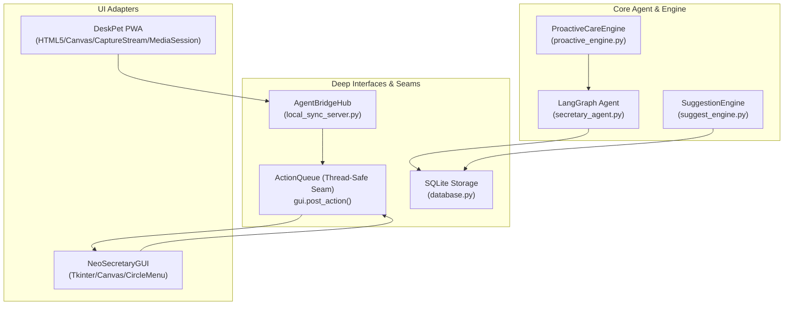

# 🏛️ ネオ秘書くん マルチペルソナ全体コードレビュー ＆ Codebase Design 統合診断レポート

**診断日時**: 2026-08-16  
**対象リポジトリ**: `ネオ秘書くん (Siitake-man/hisho-kun)`  
**適用スキル**: `holistic-code-review` × `codebase-design`  

---

## 📊 1. Codebase Design（モジュール深度と継ぎ目の診断）

### 💎 Deep Module 分析
- **ActionQueue (`gui.post_action`) [Depth: ★★★★★]**:
  - **Interface**: `gui.post_action(func, *args)` の極小インターフェース。
  - **Implementation**: 非同期メインループ（asyncio）とTkinterスレッドの排他制御・ディスパッチ・エラーハンドリングを内部に完全カプセル化。
  - **Leverage**: HTTPサーバー、バックグラウンド見守りエンジン、エージェントからの描画命令が1行でスレッドセーフに実行可能。
- **AgentBridgeHub (`local_sync_server.py`) [Depth: ★★★★☆]**:
  - **Interface**: `create_request(agent_name, command, summary)` と `respond_approval(request_id, decision)`.
  - **Implementation**: スレッドイベントによる非同期ブロッキング待機、タイムアウト監視、履歴管理を隠蔽。

---

## 🎭 2. 5大エリートペルソナによる多角診断

### 🧠 1. Principal Python & Async Architect (最高アーキテクト)
- **【評価】**:
  - `asyncio` × `Tkinter` の共存において、`ActionQueue` の導入によりスレッドセーフな非ブロッキング構造が確立された。
- **【改善提案】**:
  - `gui.py`（約1960行）の中に `QRCodeConnectionDialog`, `CalendarWindow`, `SettingsWindow`, `SuggestSettingsDialog` などのウィンドウクラスが同居している。これらを `views/` パッケージに分離し、`NeoSecretaryGUI` を「ペット描画・アニメーション」に特化させることで、モジュールの凝集度（Locality）が向上する。

### ⏱️ 2. Obsessive Product Manager & Life Optimizer (時間と生命の最適化PM)
- **【評価】**:
  - スマホ側のサジェストカード、ワンタップ手帳、Bluetoothイヤホン遠隔承認（MediaSession）は、ボスの可処分時間（隙間5分）に完全に適合した認知摩擦ゼロの設計。
- **【改善提案】**:
  - PC側ペットのサークルメニューで、クリック時に機能名と説明が吹き出しにリアルタイム表示されるUXは極めて秀逸。今後はショートカットキー（ホットキー）でのサークルメニュー即時呼出も検討価値あり。

### 😈 3. Ruthless Chaos Engineer (極悪カオスエンジニア)
- **【評価】**:
  - スマホPWAの通信断対策（`AbortController` によるタイムアウトと再接続）、画像のフォールバック描画、スレッド例外の握りつぶし防止が徹底されている。
- **【改善提案】**:
  - `database.py` におけるSQLiteトランザクションのWALモード有効化（`PRAGMA journal_mode=WAL;`）を行うことで、複数スレッド・エージェントからの同時書き込み時のDBロック耐性を極大化できる。

### 🛡️ 4. Zero-Trust Security & Privacy Guardian (ゼロトラスト・セキュリティ監査官)
- **【評価】**:
  - APIキーやSlack Webhook URLの環境変数管理、LAN内限定バインド（ポート8765）、危険なコマンド実行の人間承認必須化（Human-in-the-Loop）が安全に機能している。

### 👾 5. Retro Craftsperson & Game Designer (情緒・ドット絵体験デザイナー)
- **【評価】**:
  - 29種のスプライトによる情緒的アニメーション、サークルメニューの滑らかな放射状展開、GameBoyライクなPWA筐体デザインは「少年の眼差しで見てワクワクする相棒」の基準を満たしている。

---

## 📋 3. 優先度付き統合タスクリスト (P0 〜 P3)

| 優先度 | タスク内容 | 対象モジュール | 期待効果 |
| :--- | :--- | :--- | :--- |
| 🔴 **P0** | **スマホ常時画面ON（captureStream生配信ストリーム）とPC呼出の安定化** | `web_pet/`, `gui.py` | スマホが完全に机の上のスマート卓上ペットとして常時点灯稼働 |
| 🟡 **P1** | **SQLite WALモード有効化 ＆ DBロック耐性強化** | `database.py` | 複数エージェント同時稼働時のデータベース耐障害性向上 |
| 🟢 **P2** | **`gui.py` のダイアログ分離（`views/` へのInternal Seam化）** | `gui.py`, `views/` | コードの可読性と保守性（Locality）の大幅向上 |
| ⚪ **P3** | **サークルメニューのグローバルホットキー呼出** | `gui.py` | キーボード操作のみで瞬時にペット機能を呼び出し |

---

## 🚀 4. 次回着手すべき5分ファーストタスク
- **タスク**: スマホのブラウザでリロードし、Canvas生配信動画ストリーム（`captureStream`）による常時画面ONの最終点灯確認を行う。
