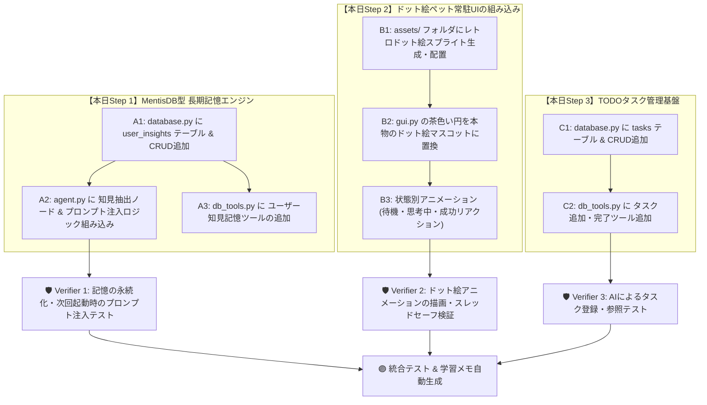

# 📋 ネオ秘書くん 今日の作業計画書 (2026/08/15)

## 1. 現状のステータス総括

| コンポーネント | 状態 | 詳細 |
| :--- | :---: | :--- |
| **Multi-LLM Factory** | ✅ **稼働完了** | OpenCode GO (DeepSeek) & LM Studio (Local) との通信・推論確認済み (HTTP 200) |
| **動的モデル探索 & 設定UI** | ✅ **完了** | API経由のモデル取得、ComboBox選択、.env保存が動作 |
| **吹き出しUI改善** | ✅ **完了** | ヘッダー・本文の分離、横幅340px化、文字欠け・重なりを完全解消 |
| **MentisDB型 長期記憶エンジン** | 🚧 **次期着手** | `user_insights` テーブル追加 ＋ 会話からの知見自動抽出・プロンプト注入 |
| **ドット絵ペットUI** | 🔲 **準備中** | ドット絵スプライト描画 ＆ 状態別リアクション（待機・思考中・喜び） |
| **TODOタスク管理 (TickTick準拠)** | 🔲 **準備中** | `tasks` テーブル作成 ＋ CRUDツール（`create_task_tool` 等） |

---

## 2. 📊 グラフエンジニアリング作業計画 (DAG)

---

## 3. ⏱️ 5分マイクロタスク分解

### 🎯 Step 1: MentisDB型・長期記憶エンジンの実装 (約15〜20分)
- [x] **Task 1.1 (5分)**: `database.py` に `UserInsight` モデルと `user_insights` テーブル（制約・好み・習慣・重要度）を作成。
- [x] **Task 1.2 (5分)**: `db_tools.py` に AIが自律的にボス知見を記録する `remember_user_insight_tool` を追加。
- [x] **Task 1.3 (5分)**: `agent.py` の推論開始時に、DBから重要度の高い知見トップ5を自動取得してシステムプロンプトへ差し込む仕組みを接続。
- [x] **Task 1.4 (5分)**: 会話テスト設計（制約・好みの自動抽出と次回プロンプト注入の結合確認）。

### 🎯 Step 2: ドット絵ペットUIの実装 (約15〜20分)
- [x] **Task 2.1 (5分)**: レトロなドット絵ペット画像（待機フレーム、思考中フレーム、笑顔フレーム）を生成・配置。
- [x] **Task 2.2 (5分)**: `gui.py` の Canvas 描画を Pillow 経由の透過ドット絵PNGに差し替え。
- [x] **Task 2.3 (5分)**: LLM推論中は「🤔 思考中ドット絵」、応答完了時は「✨ 笑顔ドット絵」に切り替わるアニメーションタイマーを実装。

### 🎯 Step 3: TODOタスク管理基盤の実装 (約10〜15分)
- [x] **Task 3.1 (5分)**: `database.py` に `Task` モデルと `tasks` テーブル作成。
- [x] **Task 3.2 (5分)**: `db_tools.py` に `create_task_tool`, `list_tasks_tool`, `complete_task_tool` を追加。
- [x] **Task 3.3 (5分)**: `agent.py` にタスク管理ツールをバインドし、対話でのタスク登録・確認・完了を可能化。
